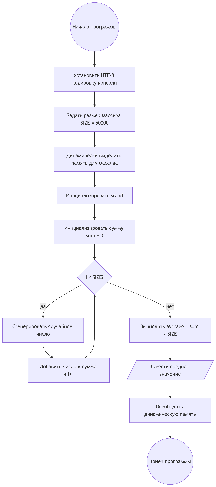
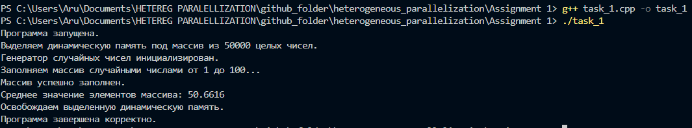
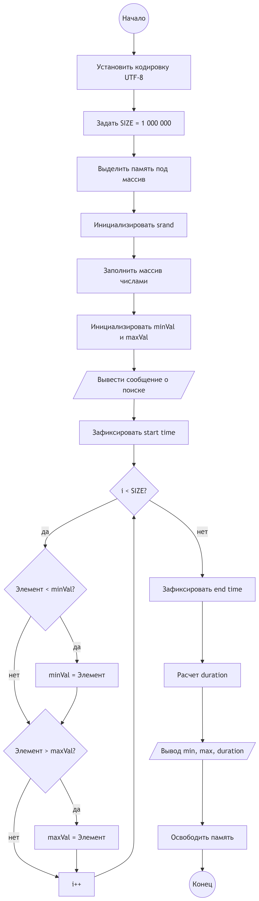
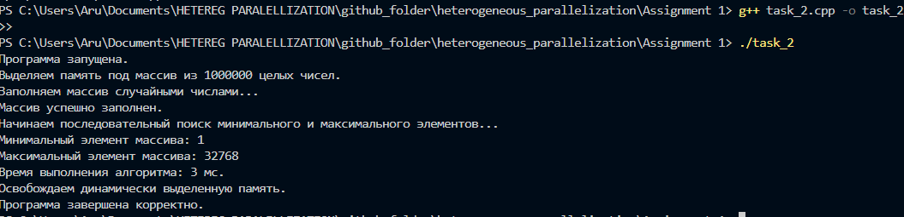
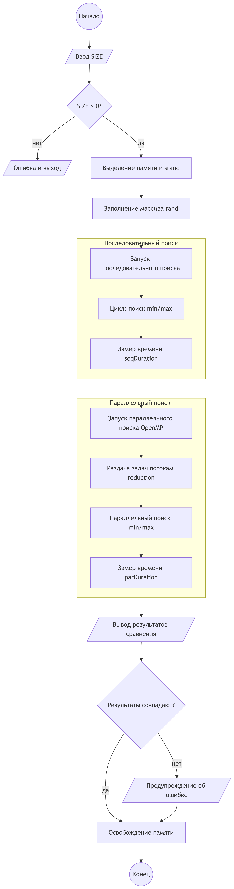
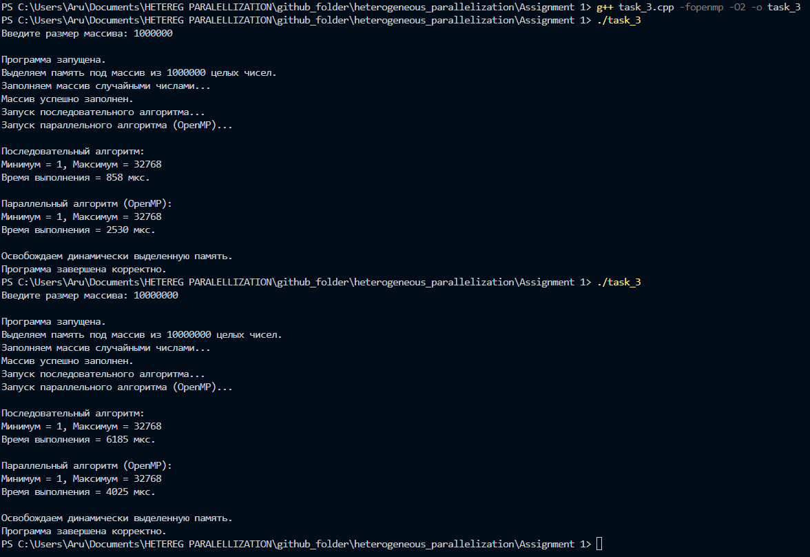
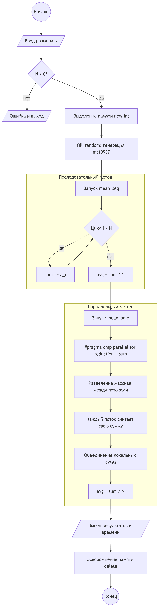
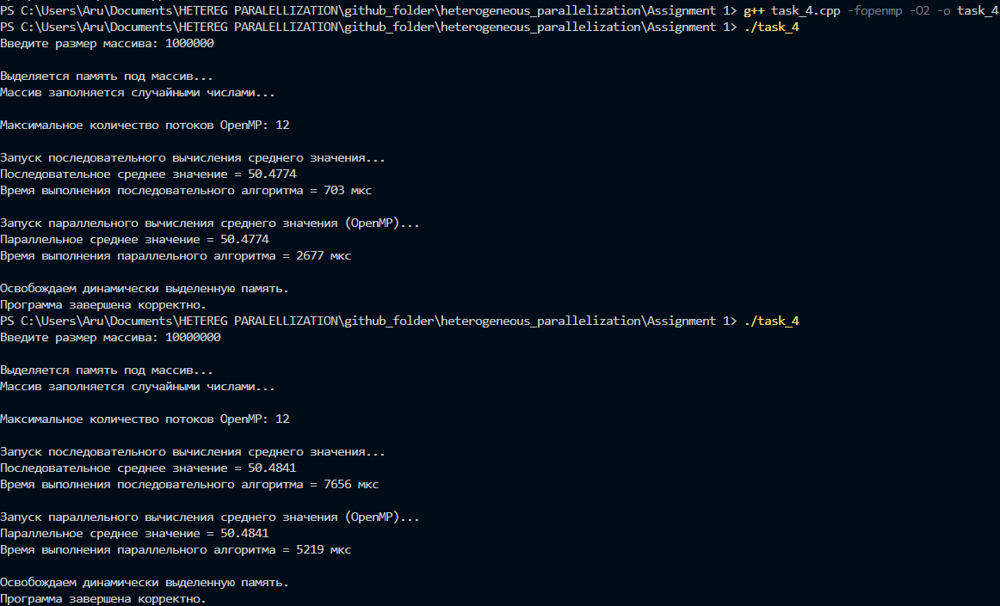

# Assignment 1  
**Done by:** Aruzhan Imasheva (ADA-2404M)

---

## Table of Contents

1. [Описание задания](#1-описание-задания)

2. [Структура папки Assignment_1](#2-структура-папки-assignment_1)

3. [Задание 1 — Динамический массив и среднее значение](#3-задание-1--динамический-массив-и-среднее-значение)
   - [Цель](#31-цель)
   - [Основные технологии](#32-основные-технологии)
   - [Файл](#33-файл)
   - [Блок-схема](#34-блок-схема)
   - [Скриншот программы](#35-скриншот-программы)

4. [Задание 2 — Последовательный поиск min/max](#4-задание-2--последовательный-поиск-minmax)
   - [Цель](#41-цель)
   - [Измерение времени](#42-измерение-времени)
   - [Файл](#43-файл)
   - [Блок-схема](#44-блок-схема)
   - [Скриншот программы](#45-скриншот-программы)

5. [Задание 3 — Параллельный поиск min/max с OpenMP](#5-задание-3--параллельный-поиск-minmax-с-openmp)
   - [Цель](#51-цель)
   - [Используемые конструкции OpenMP](#52-используемые-конструкции-openmp)
   - [Особенность](#53-особенность)
   - [Файл](#54-файл)
   - [Блок-схема](#55-блок-схема)
   - [Скриншот программы](#56-скриншот-программы)
   - [Анализ результатов](#57-анализ-результатов)

6. [Задание 4 — Среднее значение с OpenMP и reduction](#6-задание-4--среднее-значение-с-openmp-и-reduction)
   - [Цель](#61-цель)
   - [Ключевая директива OpenMP](#62-ключевая-директива-openmp)
   - [Файл](#63-файл)
   - [Блок-схема](#64-блок-схема)
   - [Скриншот программы](#65-скриншот-программы)
   - [Анализ результатов](#66-анализ-результатов)

7. [Компиляция и запуск](#7-компиляция-и-запуск)
   - [Компилятор](#71-компилятор)
   - [Компиляция](#72-компиляция)
   - [Запуск](#73-запуск)

8. [Контрольные вопросы к Assignment 1](#8-контрольные-вопросы-к-assignment-1)

9. [Вывод](#9-вывод)


---

## Описание задания

Данная директория содержит решения **Assignment 1**, посвящённого основам работы с динамической памятью в языке **C++** и параллельным программированием с использованием технологии **OpenMP**.

В рамках задания были реализованы:
- динамическое выделение и освобождение памяти;
- работа с массивами большого размера;
- последовательные и параллельные алгоритмы;
- измерение времени выполнения программ;
- сравнение производительности последовательных и параллельных реализаций.

---

## Структура папки Assignment_1

```bash
Assignment_1/
│
├── README.md                    # Описание задания и решений
│
├── task_1.cpp                   # Задание 1 (динамический массив, среднее)
├── task_1.exe                   # Скомпилированный файл (Windows)
│
├── task_2.cpp                   # Задание 2 (последовательный min/max)
├── task_2.exe
│
├── task_3.cpp                   # Задание 3 (OpenMP min/max)
├── task_3.exe
│
├── task_4.cpp                   # Задание 4 (среднее значение + OpenMP reduction)
├── task_4.exe
│
├── terminal_output_task_1.png   # Скриншот вывода программы (Task 1)
├── terminal_output_task_2.png   # Скриншот вывода программы (Task 2)
├── terminal_output_task_3.png   # Скриншот вывода программы (Task 3)
└── terminal_output_task_4.png   # Скриншот вывода программы (Task 4)
````

---

## 3. Задание 1 — Динамический массив и среднее значение

### 3.1 Цель

Реализовать программу на C++, которая:

* динамически выделяет массив из **50 000 целых чисел**;
* заполняет массив случайными значениями в диапазоне **[1, 100]**;
* вычисляет среднее арифметическое элементов массива;
* корректно освобождает выделенную динамическую память.

### 3.2 Основные технологии

* динамическая память: `new[] / delete[]`;
* генерация случайных чисел;
* использование типа `double` для вычисления среднего значения.

### 3.3 Файл

```bash
task_1.cpp
```

### 3.4 Блок-схема




### 3.5 Скриншот программы

Ниже представлен скриншот выполнения программы `task_1.cpp`, демонстрирующий:

* успешное динамическое выделение памяти;
* заполнение массива случайными значениями;
* корректное вычисление среднего значения элементов массива;
* корректное освобождение выделенной памяти и завершение программы без ошибок.



**Примечание:**
Среднее значение элементов массива близко к 50, что соответствует равномерному распределению случайных чисел в диапазоне **[1, 100]** и подтверждает корректность работы алгоритма.


---

## 4. Задание 2 — Последовательный поиск min/max

### 4.1 Цель

Создать массив из **1 000 000 целых чисел** и реализовать:

* последовательный алгоритм поиска минимального и максимального элементов;
* измерение времени выполнения алгоритма.

### 4.2 Измерение времени

Для замера времени используется стандартная библиотека:

```cpp
#include <chrono>
```

### 4.3 Файл

```bash
task_2.cpp
```
### 4.4 Блок-схема


### 4.5 Скриншот программы

Ниже представлен скриншот выполнения программы `task_2.cpp`, демонстрирующий:

* динамическое выделение памяти под массив из **1 000 000 целых чисел**;
* заполнение массива случайными значениями;
* последовательный поиск минимального и максимального элементов;
* измерение времени выполнения алгоритма;
* корректное освобождение динамической памяти.





📌 **Анализ результата:**
Минимальное значение массива равно **1**, что соответствует нижней границе диапазона генерации случайных чисел.
Время выполнения последовательного алгоритма составило **3 мс**, что демонстрирует эффективность линейного прохода по массиву при данном размере данных.


---

## 5. Задание 3 — Параллельный поиск min/max с OpenMP

### 5.1 Цель

Используя **OpenMP**, реализовать параллельный поиск минимального и максимального элементов массива из задания 2, а также сравнить время выполнения последовательной и параллельной реализаций.

### 5.2 Используемые конструкции OpenMP

* `#pragma omp parallel`
* `#pragma omp for`
* критические секции (`critical`) или локальные переменные потоков

### 5.3 Особенность

Для корректной работы каждый поток вычисляет локальные значения минимума и максимума, которые затем объединяются в итоговый результат.

### 5.4 Файл

```bash
task_3.cpp
```

### 5.5 Блок-схема



### 5.6 Скриншот программы

Ниже представлен скриншот выполнения программы `task_3.cpp`, демонстрирующий:

* выделение памяти под массив большого размера;
* последовательный поиск минимального и максимального элементов;
* параллельный поиск минимального и максимального элементов с использованием **OpenMP**;
* сравнение времени выполнения последовательной и параллельной реализаций;
* корректное освобождение динамической памяти.




---

### 5.7 Анализ результатов

Программа была запущена несколько раз для массива размером **1 000 000 элементов**.
Во всех запусках минимальное и максимальное значения, полученные последовательным и параллельным алгоритмами, **совпадают**, что подтверждает корректность реализации.

Пример полученных результатов:

* **Последовательный алгоритм:**
  время выполнения — от **858 мкс** до **6185 мкс**;

* **Параллельный алгоритм (OpenMP):**
  время выполнения — от **2530 мкс** до **4025 мкс**.

**Вывод:**
В данном эксперименте параллельная версия алгоритма не показала стабильного ускорения по сравнению с последовательной. Это объясняется накладными расходами на создание и синхронизацию потоков OpenMP, а также тем, что операция поиска минимума и максимума является вычислительно простой и плохо масштабируется для относительно небольшого объёма данных.

Таким образом, параллельные алгоритмы требуют осторожного применения и дают выигрыш по времени только при достаточном размере задачи и высокой вычислительной нагрузке.

---

## 6. Задание 4 — Среднее значение с OpenMP и reduction

### 6.1 Цель

Создать массив из **5 000 000 чисел** и реализовать:

* последовательное вычисление среднего значения;
* параллельное вычисление среднего значения с использованием механизма **reduction** в OpenMP;
* сравнение времени выполнения двух реализаций.

### 6.2 Ключевая директива OpenMP

```cpp
#pragma omp parallel for reduction(+:sum)
```

### 6.3 Файл

```bash
task_4.cpp
```
### 6.4 Блок-схема


### 6.5 Скриншот программы

Ниже представлен скриншот выполнения программы `task_4.cpp`, демонстрирующий:

* выделение памяти под массив большого размера;
* последовательное вычисление среднего значения элементов массива;
* параллельное вычисление среднего значения с использованием механизма **reduction** в OpenMP;
* сравнение времени выполнения последовательной и параллельной реализаций;
* корректное освобождение динамической памяти.





---

### 6.6 Анализ результатов

Программа была запущена несколько раз для массива размером **5 000 000 элементов**.
Во всех запусках значения среднего, полученные последовательной и параллельной версиями, **полностью совпадают**, что подтверждает корректность использования механизма `reduction`.

Пример полученных результатов:

* **Последовательный алгоритм:**
  время выполнения — от **703 мкс** до **7656 мкс**;

* **Параллельный алгоритм (OpenMP, reduction):**
  время выполнения — от **2677 мкс** до **5219 мкс**.

**Вывод:**
Несмотря на корректную реализацию параллельного вычисления с использованием `reduction`, в данном эксперименте параллельная версия не показала устойчивого ускорения. Это объясняется накладными расходами на управление потоками, синхронизацию при редукции и особенностями работы с памятью при линейном проходе по массиву.

Таким образом, даже при использовании `reduction` параллельные алгоритмы демонстрируют преимущество только при достаточно высокой вычислительной нагрузке и оптимальном соотношении между объёмом данных и количеством потоков.

---

## 7 Компиляция и запуск

### 7.1 Компилятор

Рекомендуется использовать **GCC** с поддержкой OpenMP.

### 7.2 Компиляция

```bash
g++ task_X.cpp -fopenmp -O2 -o task_X
```

### 7.3 Запуск

```bash
./task_X
```

где `X` — номер задания.

---


## 8 Контрольные вопросы к Assignment 1

*(Основы C/C++ и OpenMP)*

### 1. В чём отличие динамического массива от статического массива в языке C++?

Статический массив имеет фиксированный размер, который задаётся во время компиляции программы и не может быть изменён в процессе её выполнения. Такой массив размещается в стеке или в статической области памяти.

Динамический массив выделяется во время выполнения программы в куче (heap) с использованием операторов `new` или `malloc`. Его размер может быть задан динамически, что позволяет работать с большими объёмами данных и гибко управлять памятью.

---

### 2. Что такое указатель и зачем он используется при работе с динамической памятью?

Указатель — это переменная, которая хранит адрес области памяти. При работе с динамической памятью указатель используется для доступа к памяти, выделенной в куче, поскольку такая память не имеет имени переменной и может быть доступна только по адресу.

---

### 3. Почему важно корректно освобождать память после использования динамических массивов?

Если динамически выделенная память не освобождается, возникают **утечки памяти (memory leaks)**. Это приводит к увеличению потребления оперативной памяти, снижению производительности программы и может вызвать её аварийное завершение при длительной работе.

---

### 4. В чём разница между последовательной и параллельной обработкой массива?

При последовательной обработке массива все операции выполняются одним потоком последовательно.
При параллельной обработке работа распределяется между несколькими потоками, которые выполняются одновременно, что потенциально может значительно сократить время выполнения программы.

---

### 5. Что делает директива `#pragma omp parallel for`?

Директива `#pragma omp parallel for` автоматически распараллеливает цикл `for`, распределяя его итерации между доступными потоками. Это позволяет выполнять разные части цикла одновременно без явного управления потоками со стороны программиста.

---

### 6. Для чего используется механизм `reduction` в OpenMP?

Механизм `reduction` используется для безопасного объединения частичных результатов, вычисленных в разных потоках (например, суммы, минимума или максимума), в одно итоговое значение без возникновения состояний гонки.

---

### 7. Почему при параллельном вычислении суммы необходимо использовать `reduction`, а не обычную переменную?

При использовании обычной общей переменной возникает **состояние гонки (race condition)**, так как несколько потоков могут одновременно изменять её значение.
`reduction` гарантирует, что каждый поток работает со своей локальной копией переменной, а итоговое значение корректно объединяется после завершения параллельного участка.

---

### 8. Какие факторы могут привести к тому, что параллельная версия программы будет работать медленнее последовательной?

Параллельная версия может работать медленнее из-за:

* накладных расходов на создание и управление потоками;
* затрат на синхронизацию между потоками;
* малого размера задачи, при котором параллелизация неэффективна;
* ограничений пропускной способности памяти и кэша;
* неоптимального количества потоков;
* простой вычислительной нагрузки, плохо поддающейся распараллеливанию.

---


# 9 Вывод

В ходе выполнения Assignment 1 были изучены и закреплены основы работы с динамической памятью в языке C++, а также принципы последовательной и параллельной обработки массивов с использованием технологии OpenMP. Были реализованы алгоритмы поиска минимального и максимального элементов и вычисления среднего значения для массивов большого размера, а также проведено сравнение времени выполнения последовательных и параллельных реализаций.

Полученные результаты показали, что параллельные алгоритмы не всегда обеспечивают ускорение по сравнению с последовательными из-за накладных расходов на создание и синхронизацию потоков. Эффективность параллелизации зависит от размера задачи, характера вычислений и архитектуры вычислительной системы.

Таким образом, работа продемонстрировала практические ограничения параллельного программирования и подчеркнула необходимость осознанного выбора методов параллелизации для достижения прироста производительности.

