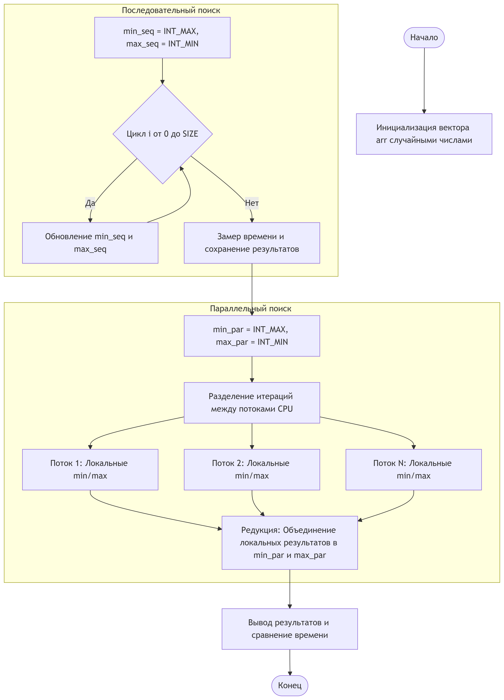
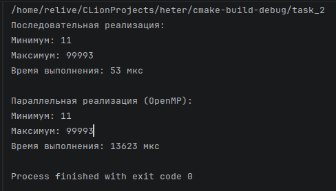
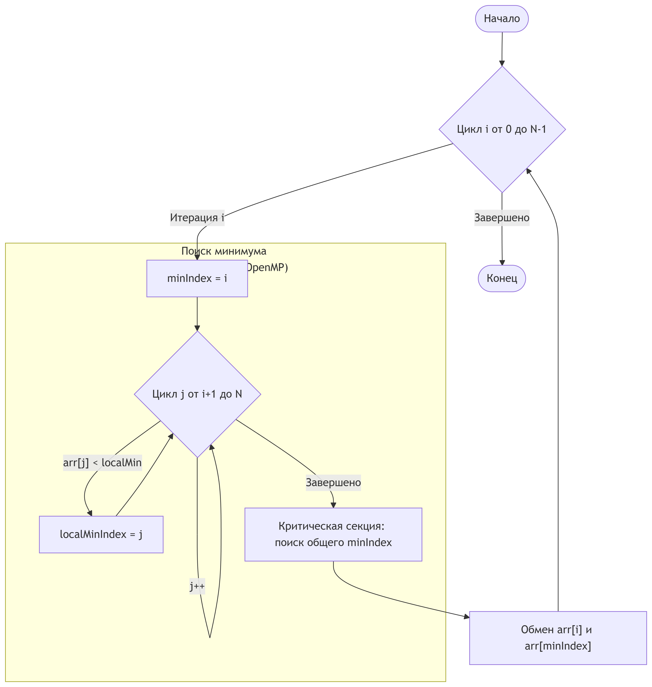
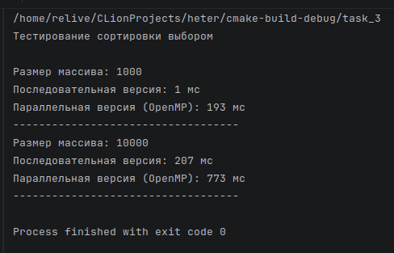
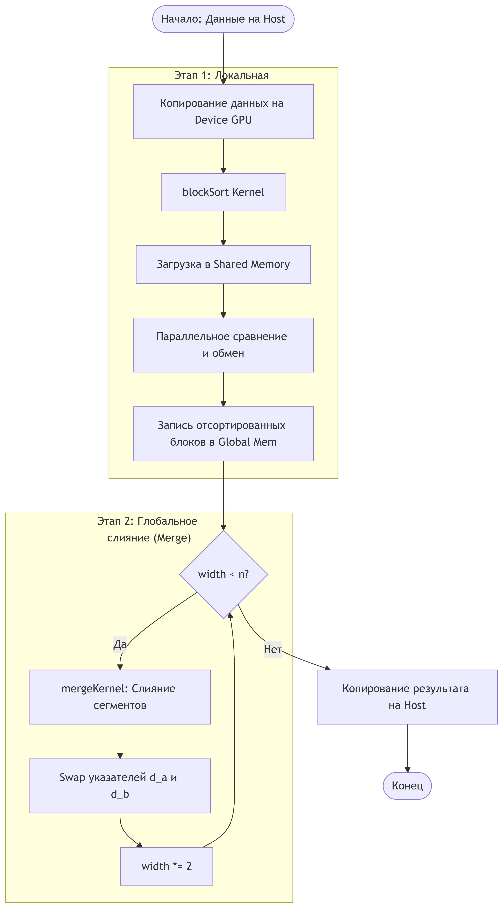
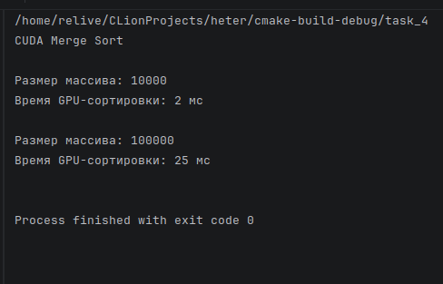

# Assignment 2  
**Done by:** Aruzhan Imasheva (ADA-2404M)

# 📑 Содержание

* [Задача 1. Введение в гетерогенную параллелизацию](#-задача-1)
* [Задача 2. Работа с массивами и OpenMP](#-задача-2)
* [Задача 3. Параллельная сортировка с OpenMP](#-задача-3)
* [Задача 4. Сортировка на GPU с использованием CUDA](#-задача-4)
* [Контрольные вопросы к Assignment 2](#-конрольные-вопросы)

# Контрольные вопросы к Assignment 2

---

# **Задача 1. Введение в гетерогенную параллелизацию**

### **Понятие гетерогенной параллелизации**

**Гетерогенная параллелизация** — это подход к параллельным вычислениям, при котором в одной программе **совместно используются разные вычислительные устройства**, прежде всего **CPU и GPU**.
Идея заключается в том, что разные части задачи выполняются на том устройстве, которое лучше всего подходит для конкретного типа вычислений.

В типичном сценарии **CPU отвечает за логику программы, управление потоками и подготовку данных**, а **GPU используется для ускорения вычислительно сложных и массово-параллельных операций**.

---

### **1. Различия между параллельными вычислениями на CPU и GPU**

На практике различия между CPU и GPU хорошо проявляются при работе с большими массивами данных.

**CPU**:

* имеет небольшое количество мощных универсальных ядер;
* эффективно обрабатывает задачи со сложной логикой, ветвлениями и последовательными участками;
* подходит для управления программой и координации вычислений.

**GPU**:

* содержит тысячи простых вычислительных ядер;
* оптимизирован для выполнения одинаковых операций над большим объёмом данных;
* обеспечивает высокую пропускную способность при работе с массивами и матрицами.

Таким образом, **CPU лучше подходит для управления вычислениями**, а **GPU — для их ускорения**.

---

### **2. Преимущества гетерогенной параллелизации**

Использование гетерогенного подхода даёт несколько важных преимуществ:

* **Значительное ускорение программ**, особенно при работе с большими наборами данных;
* **Рациональное распределение нагрузки**, при котором CPU не перегружается вычислительно тяжёлыми операциями;
* **Повышение энергоэффективности**, так как GPU выполняет массовые операции быстрее и экономичнее;
* **Хорошая масштабируемость**, что особенно важно для научных и инженерных задач;
* **Гибкость архитектуры**, позволяющая добавлять другие ускорители при необходимости.

---

### **3. Примеры реальных приложений**

#### **Примеры задач гетерогенной параллелизации на основе моей работы и реальных применений**

##### **1. Анализ медицинских изображений (маммография, гистопатология)**

**Как применяется на практике:**
В медицинских системах диагностики необходимо обрабатывать **тысячи высокоразрешённых изображений**, где каждая секунда задержки может иметь клиническое значение.

**Как используется гетерогенная параллелизация:**

* **CPU**:

  * загрузка медицинских изображений (DICOM, TIFF);
  * формирование пар проекций (CC и MLO);
  * управление пайплайном обработки и очередями данных;
* **GPU**:

  * инференс нейронных сетей;
  * параллельная обработка изображений;
  * извлечение признаков и классификация.

**Реальный эффект:**
Такие системы позволяют радиологам получать результаты предварительного анализа **в режиме, близком к реальному времени**, что снижает нагрузку на врача и повышает точность диагностики.

---

##### **2. Обучение и инференс нейронных сетей (deep learning)**

**Как применяется на практике:**
Обучение современных моделей глубокого обучения без GPU практически невозможно из-за огромного количества матричных операций.

**Как используется гетерогенная параллелизация:**

* **CPU**:

  * подготовка датасетов;
  * аугментации изображений;
  * балансировка классов и формирование батчей;
* **GPU**:

  * вычисление свёрток;
  * расчёт градиентов;
  * обновление параметров модели.

**Реальный эффект:**
Модели, обучение которых на CPU заняло бы недели, на GPU обучаются за часы или дни, что делает возможными быстрые итерации и экспериментирование.

---

##### **3. Инференс и потоковая обработка данных в продакшене**

**Как применяется на практике:**
В реальных системах (например, в медицинских клиниках или облачных сервисах) модели работают в режиме непрерывной обработки входящих данных.

**Как используется гетерогенная параллелизация:**

* **CPU**:

  * приём запросов;
  * управление очередями и батчингом;
  * постобработка результатов;
* **GPU**:

  * массовый инференс нейросетей;
  * параллельная обработка запросов.

**Реальный эффект:**
Система может обслуживать большое количество пользователей или медицинских исследований без потери скорости.

---

##### **4. Обработка больших изображений и WSI (Whole Slide Images)**

**Как применяется на практике:**
В гистопатологии изображения могут достигать **десятков гигапикселей**, и их невозможно обработать целиком.

**Как используется гетерогенная параллелизация:**

* **CPU**:

  * разбиение изображений на патчи;
  * управление файловой системой и потоками ввода-вывода;
* **GPU**:

  * параллельная обработка патчей;
  * классификация и сегментация.

**Реальный эффект:**
Это делает возможным автоматизированный анализ биопсий и поддержку принятия клинических решений.

---

##### **5. Параллельные алгоритмы сортировки и обработки массивов (CUDA)**

**Как применяется на практике:**
Алгоритмы сортировки используются внутри более сложных систем:

* предварительная обработка данных;
* ускорение аналитических задач;
* оптимизация доступа к данным.

**Как используется гетерогенная параллелизация:**

* **CPU**:

  * управление алгоритмом;
  * запуск CUDA-ядер;
* **GPU**:

  * параллельные сравнения и перестановки элементов.

**Реальный эффект:**
При больших объёмах данных GPU-реализация показывает существенный выигрыш по времени по сравнению с CPU.

---

##### **6. Анализ больших наборов данных и научные вычисления**

**Как применяется на практике:**
Научные исследования часто требуют обработки больших объёмов данных за ограниченное время.

**Как используется гетерогенная параллелизация:**

* **CPU**:

  * логика экспериментов;
  * контроль параметров;
* **GPU**:

  * параллельные численные вычисления;
  * ускорение статистических расчётов.

**Реальный эффект:**
Исследователи могут проводить больше экспериментов за то же время и быстрее получать результаты.

---

#### Общие примеры 

Отлично, тогда сделаю **широкий, прикладной обзор именно приложений**, без привязки к личному опыту — **что за программы, где они используются, как именно внутри них применяется гетерогенная параллелизация и зачем**. Это формат, который преподаватели обычно очень любят.

---

#### **1. Системы компьютерного зрения и обработки изображений**

**Где используются:**
видеонаблюдение, медицинская визуализация, автономные автомобили, спутниковая съёмка.

**Как применяется гетерогенная параллелизация:**

* **CPU**:

  * управление видеопотоком;
  * декодирование изображений;
* **GPU**:

  * фильтрация изображений;
  * детекция объектов;
  * сегментация и классификация.

**Почему используется:**
Обработка каждого кадра или пикселя может выполняться независимо, что идеально подходит для GPU.

---

#### **2. Компьютерная графика и игровые движки**

**Где используются:**
игровые движки (Unreal Engine, Unity), системы визуализации, 3D-моделирование.

**Как применяется гетерогенная параллелизация:**

* **CPU**:

  * игровая логика;
  * физика объектов;
* **GPU**:

  * рендеринг сцены;
  * шейдеры;
  * трассировка лучей.

**Почему используется:**
Рендеринг миллионов полигонов и пикселей требует высокой параллельности, доступной только на GPU.

---

#### **3. Приложения для научных и инженерных вычислений**

**Где используются:**
физика, химия, биология, аэродинамика, климатическое моделирование.

**Как применяется гетерогенная параллелизация:**

* **CPU**:

  * управление расчётами;
  * адаптивные алгоритмы;
* **GPU**:

  * численное решение уравнений;
  * моделирование процессов.

**Почему используется:**
GPU позволяет выполнять сложные численные расчёты быстрее и масштабируемее.

---

#### **4. Системы обработки больших данных**

**Где используются:**
финансовая аналитика, телекоммуникации, маркетинг, научные исследования.

**Как применяется гетерогенная параллелизация:**

* **CPU**:

  * управление задачами;
  * распределение данных;
* **GPU**:

  * ускорение аналитических операций;
  * агрегация и фильтрация данных.

**Почему используется:**
GPU позволяет обрабатывать большие массивы данных за меньшее время.

---

#### **5. Приложения для криптографии и блокчейна**

**Где используются:**
криптовалюты, системы безопасности, хэширование.

**Как применяется гетерогенная параллелизация:**

* **CPU**:

  * управление транзакциями;
* **GPU**:

  * массовое вычисление хэшей.

**Почему используется:**
Хэш-функции легко распараллеливаются и хорошо подходят для GPU.

---

#### **6. Видеообработка и мультимедиа**

**Где используются:**
стриминговые сервисы, видеомонтаж, видеоконференции.

**Как применяется гетерогенная параллелизация:**

* **CPU**:

  * управление потоками;
  * кодеки;
* **GPU**:

  * аппаратное кодирование и декодирование;
  * фильтрация и масштабирование видео.

**Почему используется:**
GPU снижает задержки и ускоряет обработку видео.

---

# 📌 Задача 2. Работа с массивами и OpenMP

**Описание:**
Программа на C++ создаёт массив из 10 000 случайных чисел и находит минимальное и максимальное значения:

* в последовательной реализации;
* в параллельной реализации с использованием **OpenMP**.

Также проводится сравнение времени выполнения.

### 📂 Исходный код

* `task_2.cpp`

### 🧩 Блок-схема алгоритма

### 🖥️ Вывод программы

Да, конечно. Вот **краткий и корректный conclusion именно для этого output**, в академическом стиле — можно **прямо вставлять под вывод в README или отчёт**.

---

В результате выполнения программы было установлено, что для массива размером 10 000 элементов **последовательная реализация** поиска минимума и максимума оказалась значительно быстрее, чем **параллельная реализация с использованием OpenMP**.

Это объясняется тем, что накладные расходы на создание и управление потоками, синхронизацию и редукцию результатов в OpenMP **превышают выигрыш от параллелизма** при сравнительно небольшом объёме данных и простой вычислительной операции.

Таким образом, использование OpenMP для данной задачи **не является эффективным**, и параллельный подход оправдан только при обработке существенно больших массивов или более вычислительно сложных операций.

---

# 📌 Задача 3. Параллельная сортировка с OpenMP

**Описание:**
Реализован алгоритм **сортировки выбором**:

* последовательная версия;
* параллельная версия с использованием директив **OpenMP**.

Тестирование выполнено для массивов размером **1 000** и **10 000** элементов.

### 📂 Исходный код

* `task_3.cpp`

### 🧩 Блок-схема алгоритма

### 🖥️ Вывод программы

---

Результаты тестирования сортировки выбором показывают, что параллельная реализация с использованием OpenMP уступает последовательной версии как для массива из 1 000 элементов, так и для массива из 10 000 элементов.

Это связано с особенностями алгоритма сортировки выбором: он содержит последовательные зависимости (поиск минимального элемента на каждой итерации), которые ограничивают эффективный параллелизм. Дополнительные накладные расходы на создание потоков и синхронизацию в OpenMP приводят к значительному увеличению времени выполнения по сравнению с простой последовательной реализацией.

Таким образом, сортировка выбором плохо подходит для параллелизации с использованием OpenMP и не демонстрирует ускорения даже при увеличении размера входных данных. Для параллельной сортировки более эффективны алгоритмы с лучшей структурой параллелизма, такие как сортировка слиянием или быстрая сортировка.

---

# 📌 Задача 4. Сортировка на GPU с использованием CUDA

**Описание:**
Реализована **параллельная сортировка слиянием** на GPU с использованием **CUDA**:

* массив разбивается на подмассивы, обрабатываемые отдельными CUDA-блоками;
* выполняется параллельное слияние отсортированных подмассивов;
* измеряется производительность для массивов размером **10 000** и **100 000** элементов.

### 📂 Исходный код

* `task_4.cu`

### 🧩 Блок-схема алгоритма

### 🖥️ Вывод программы

---
Результаты выполнения параллельной сортировки слиянием на GPU с использованием CUDA показывают высокую эффективность данного подхода. Для массива размером 10 000 элементов время сортировки составило 2 мс, а при увеличении размера массива до 100 000 элементов — 25 мс, что демонстрирует хорошую масштабируемость алгоритма.

В отличие от задач с использованием OpenMP, где накладные расходы на управление потоками нивелировали преимущества параллелизма, реализация на GPU эффективно использует массовый параллелизм архитектуры CUDA. Алгоритм сортировки слиянием хорошо адаптируется к GPU благодаря независимой обработке подмассивов и параллельному этапу слияния.

Таким образом, использование GPU для вычислительно интенсивных задач сортировки является оправданным и значительно превосходит CPU-подходы при работе с большими объёмами данных, что подтверждает эффективность гетерогенной параллелизации.
---

# Контрольные вопросы к Assignment 2
---

## 1. Что понимается под гетерогенной параллелизацией?

**Гетерогенная параллелизация** — это подход к вычислениям, при котором в рамках одного приложения **одновременно используются разные типы вычислительных устройств**, чаще всего **CPU и GPU**, с распределением задач в зависимости от их характера.

CPU выполняет:

* управление программой;
* последовательные и логически сложные участки;
* подготовку данных.

GPU выполняет:

* массово-параллельные вычисления;
* однотипные операции над большими массивами данных.

Такой подход позволяет максимально эффективно использовать ресурсы системы.

---

## 2. В чём принципиальные различия архитектур CPU и GPU?

Основные различия заключаются в архитектуре и назначении:

* **CPU** имеет небольшое число мощных ядер, оптимизированных для:

  * сложной логики;
  * ветвлений;
  * последовательного исполнения кода;
  * низкой задержки выполнения.

* **GPU** содержит тысячи простых ядер, оптимизированных для:

  * параллельного выполнения одинаковых операций;
  * высокой пропускной способности;
  * обработки больших объёмов данных.

CPU ориентирован на универсальность, GPU — на массовый параллелизм.

---

## 3. Какие типы задач лучше подходят для выполнения на GPU, а какие — на CPU?

**На GPU лучше всего подходят задачи:**

* обработка изображений и видео;
* линейная алгебра (умножение матриц);
* сортировка и фильтрация больших массивов;
* обучение нейронных сетей;
* численное моделирование.

**На CPU лучше подходят задачи:**

* управление программой;
* алгоритмы с большим количеством ветвлений;
* задачи с сильными зависимостями между шагами;
* ввод-вывод и работа с файлами;
* подготовка и агрегация данных.

---

## 4. Почему не все алгоритмы эффективно распараллеливаются с использованием OpenMP?

Не все алгоритмы хорошо распараллеливаются, потому что:

* между итерациями могут существовать **зависимости по данным**;
* часть алгоритма является строго последовательной;
* накладные расходы на создание и синхронизацию потоков могут превышать выигрыш;
* при малом объёме данных параллелизация неэффективна.

Примером является сортировка выбором, где внешний цикл не может быть распараллелен.

---

## 5. В чём заключается основная идея алгоритма сортировки слиянием?

Основная идея **сортировки слиянием (Merge Sort)** заключается в принципе *«разделяй и властвуй»*:

1. Массив рекурсивно делится на две части.
2. Каждая часть сортируется независимо.
3. Отсортированные подмассивы сливаются в один отсортированный массив.

Алгоритм имеет асимптотическую сложность **O(n log n)** и хорошо подходит для параллельных вычислений.

---

## 6. Какие сложности возникают при реализации сортировки слиянием на GPU?

При реализации сортировки слиянием на GPU возникают следующие сложности:

* сложность эффективного параллельного слияния;
* необходимость синхронизации потоков;
* ограниченный объём shared memory;
* высокая стоимость доступа к глобальной памяти;
* накладные расходы на копирование данных между CPU и GPU.

Поэтому на практике часто используется гибридный подход: сортировка подмассивов в блоках и итеративное слияние.

---

## 7. Как выбор размера блока и сетки влияет на производительность вычислений на GPU?

Размер блока и сетки напрямую влияет на:

* степень загрузки GPU;
* количество одновременно выполняемых потоков;
* использование shared memory;
* эффективность скрытия задержек памяти.

Слишком маленькие блоки приводят к плохой загрузке GPU, слишком большие — к нехватке ресурсов. Оптимальный размер блока позволяет максимально эффективно использовать вычислительные блоки GPU.

---

## 8. Почему гетерогенный подход может быть эффективнее использования только CPU или только GPU?

Гетерогенный подход эффективнее, потому что:

* CPU и GPU используются **по своему назначению**;
* снижается время выполнения за счёт распределения задач;
* уменьшается нагрузка на каждое устройство;
* достигается лучшее соотношение производительности и энергопотребления.

В результате система работает быстрее и эффективнее, чем при использовании только одного типа вычислительных ресурсов.

---

### ✅ Итог

Контрольные вопросы показывают, что гетерогенные вычисления позволяют сочетать сильные стороны CPU и GPU, однако требуют правильного выбора алгоритмов и грамотного распределения вычислительной нагрузки.

Если хочешь — могу:

* **сократить ответы** под строгий лимит символов;
* оформить **в виде Word-документа**;
* или адаптировать стиль под конкретного преподавателя.

