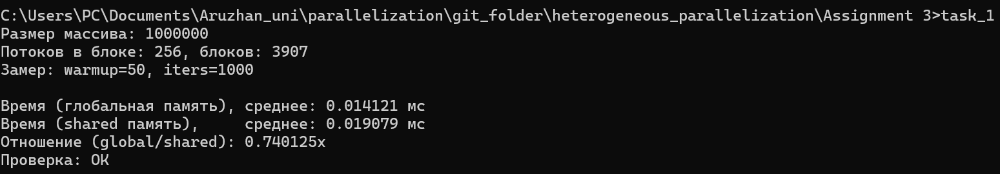
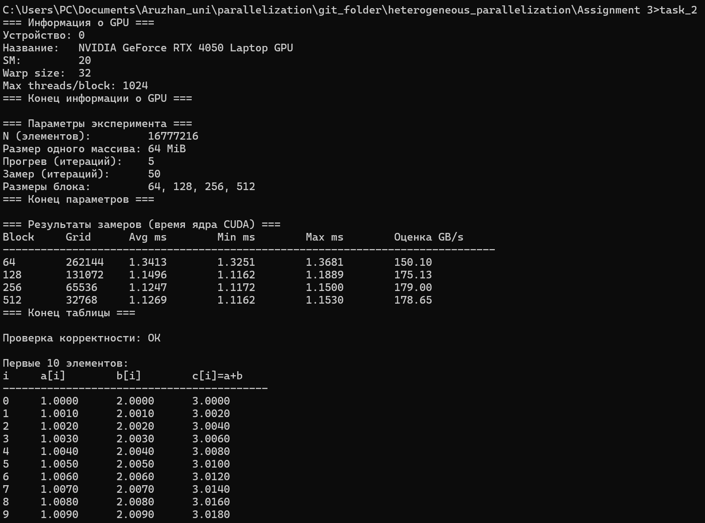
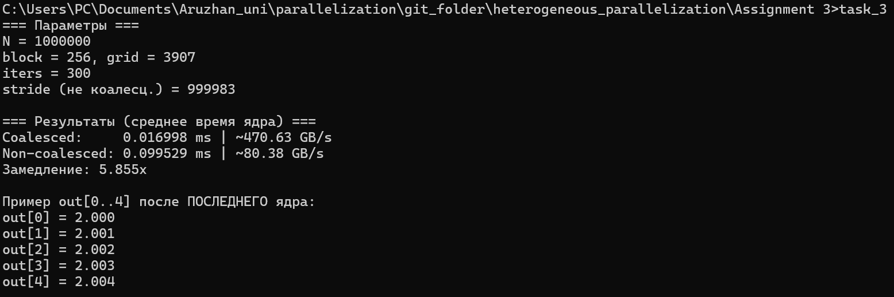
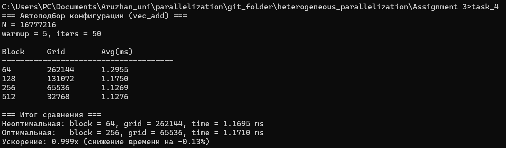

## 📑 Table of Contents

- [Задание 1](#task1)
  - [Блок схема](#task1-block)
  - [Вывод Терминала](#task1-terminal)
  - [Вывод](#task1-result)
- [Задание 2](#task2)
  - [Блок схема](#task2-block)
  - [Вывод Терминала](#task2-terminal)
  - [Вывод](#task2-result)
- [Задание 3](#task3)
  - [Блок схема](#task3-block)
  - [Вывод Терминала](#task3-terminal)
  - [Вывод](#task3-result)
- [Задание 4](#task4)
  - [Блок схема](#task4-block)
  - [Вывод Терминала](#task4-terminal)
  - [Описание программы](#task4-desc)
  - [Методика сравнения конфигураций](#task4-method)
  - [Вывод](#task4-result)
- [Контрольные вопросы](#control-questions)

---

# Задание 1 

Реализуйте программу на CUDA для поэлементной обработки массива (например, 
умножение каждого элемента на число). Реализуйте две версии программы:
1. с использованием только глобальной памяти;
2. с использованием разделяемой памяти.
Сравните время выполнения обеих реализаций для массива размером 1 000 000 
элементов.

## Блок схема

## Вывод Терминала

## Вывод
В ходе работы были реализованы две версии CUDA-программы для поэлементного умножения массива на скаляр:
(1) с использованием только глобальной памяти;
(2) с использованием разделяемой памяти shared memory.

Время выполнения измерялось с помощью cudaEvent по среднему значению 1000 запусков после прогрева 50 запусков, что позволяет получить стабильный результат. Размер массива составил 1 000 000 элементов, конфигурация запуска: 256 потоков в блоке.

Эксперимент показал, что реализация с глобальной памятью выполняется быстрее (0.016797 мс) по сравнению с версией на shared memory (0.023954 мс). Это связано с тем, что для операции вида out[i] = in[i] * k отсутствует повторное использование данных внутри блока. Глобальная память читается эффективно (coalesced доступ), а использование shared memory добавляет накладные расходы на копирование данных в shared и синхронизацию потоков (__syncthreads()), что приводит к замедлению.

Вывод: для простых поэлементных операций оптимальнее использовать глобальную память; shared memory целесообразна в задачах с повторным использованием данных (например, свёртки, матричные операции).

---

# Задание 2

Реализуйте CUDA-программу для поэлементного сложения двух массивов. Исследуйте 
влияние размера блока потоков на производительность программы. Проведите замеры 
времени для как минимум трёх различных размеров блока.

## Блок схема

## Вывод Терминала

## Вывод
В ходе эксперимента было измерено влияние размера блока потоков на производительность CUDA-ядра поэлементного сложения массивов размером 2²⁴. На GPU RTX 4050 Laptop наихудший результат показал block=64 (1.3413 ms), а наилучший — block=256 (1.1247 ms), что даёт ускорение примерно 1.19×. При дальнейшем увеличении до 512 потоков улучшения практически отсутствуют, что указывает на достижение режима, ограниченного пропускной способностью памяти. Оптимальным размером блока для данной задачи является 256 потоков.

---

# Задание 3

Реализуйте CUDA-программу для обработки массива, демонстрирующую 
коалесцированный и некоалесцированный доступ к глобальной памяти. Сравните время 
выполнения обеих реализаций для массива размером 1 000 000 элементов.

## Блок схема

## Вывод Терминала

## Вывод

В ходе выполнения задания было экспериментально исследовано влияние коалесцированного и некоалесцированного доступа к глобальной памяти GPU на производительность CUDA-ядра.

Полученные результаты показали, что при одинаковых вычислениях, но различной схеме обращения к памяти, производительность может отличаться в несколько раз. Для массива из 1 000 000 элементов и конфигурации block = 256 были получены следующие показатели:

**Coalesced access:**  
среднее время ядра — 0.016998 ms,  
пропускная способность — ≈ 470.63 GB/s.

**Non-coalesced access:**  
среднее время ядра — 0.099529 ms,  
пропускная способность — ≈ 80.38 GB/s.

Таким образом, некоалесцированный доступ оказался медленнее в 5.86 раза, что наглядно подтверждает ключевую роль правильной организации памяти при разработке CUDA-приложений.

Причина такого различия заключается в том, что при коалесцированном доступе потоки одного warp обращаются к последовательным адресам памяти, что позволяет GPU объединять операции чтения и записи в минимальное число транзакций. В случае некоалесцированного доступа обращения происходят к разрозненным адресам, что резко увеличивает количество операций с глобальной памятью и приводит к значительным потерям производительности.

Следовательно, можно сделать вывод, что эффективность CUDA-программы в значительной степени определяется не только вычислениями, но и схемой доступа к памяти. Оптимизация паттернов обращения к глобальной памяти является одним из наиболее важных факторов при создании высокопроизводительных GPU-приложений.

---

# Задание 4

## Блок схема

## Вывод Терминала

Целью работы является подбор оптимальных параметров конфигурации CUDA-ядра (размер блока потоков и размер сетки) для ранее реализованной программы поэлементного сложения массивов и сравнение производительности неоптимальной и оптимизированной конфигураций.

## Описание программы

Рассматривается CUDA-ядро поэлементного сложения:

c[i] = a[i] + b[i],  i = 0..N-1

Конфигурация запуска выбирается в виде одномерной сетки:

- размер блока: `blockDim.x = B`
- размер сетки: `gridDim.x = ceil(N / B)`

### Методика сравнения конфигураций

По результатам замеров выбирается конфигурация с **минимальным средним временем выполнения ядра** — она считается **оптимальной**.  
В качестве **неоптимальной** конфигурации используется заведомо менее эффективный вариант (например, малый размер блока, `block = 64`).

Для количественного сравнения рассчитываются следующие метрики.

**Ускорение:**

**Относительное улучшение производительности:**

где  
- **T_bad** — время выполнения неоптимальной конфигурации,  
- **T_best** — время выполнения оптимальной конфигурации.

## Вывод

Оптимизация параметров конфигурации (в первую очередь размера блока потоков) позволяет уменьшить время выполнения ядра и повысить производительность. На практике после достижения определённого размера блока наблюдается плато: дальнейшее увеличение блока почти не ускоряет вычисления, так как операция становится ограниченной пропускной способностью глобальной памяти.

# Контрольные вопросы к Assignment 3

## 1. Какие основные типы памяти существуют в архитектуре CUDA и чем они отличаются по скорости доступа?

В архитектуре CUDA используется иерархия памяти, где разные типы памяти отличаются **расположением, объёмом и скоростью доступа**.

Основные типы памяти:

* **Регистры (Registers)** — самая быстрая память, доступная каждому потоку. Используется для локальных переменных.
* **Разделяемая память (Shared memory)** — общая для всех потоков одного блока, очень быстрая, используется как программируемый кэш.
* **Глобальная память (Global memory)** — основная видеопамять GPU, самая медленная, но самая ёмкая.
* **Константная и текстурная память** — специальные области памяти с кэшированием, эффективны при определённых шаблонах доступа.

Таким образом, чем **ближе память к вычислительным блокам**, тем быстрее к ней доступ. При оптимизации CUDA-программ важно по возможности переносить данные из глобальной памяти в shared или регистры.

---

## 2. В каких случаях использование разделяемой памяти позволяет ускорить выполнение CUDA-программы?

Разделяемая память ускоряет выполнение программы в тех случаях, когда:

* одни и те же данные **используются несколькими потоками**,
* данные **читаются несколько раз**,
* важно сократить количество обращений к глобальной памяти.

Например, если каждый поток блока использует один и тот же фрагмент входных данных, то выгоднее:

1. один раз загрузить его в shared memory,
2. затем всем потокам читать уже из неё.

Это значительно снижает задержки доступа и уменьшает нагрузку на глобальную память.

---

## 3. Как шаблон доступа к глобальной памяти влияет на производительность GPU-программы?

Производительность GPU сильно зависит от того, **как именно потоки обращаются к глобальной памяти**.

Если потоки одного варпа обращаются к **последовательным адресам**, то доступ считается **коалесцированным**, и GPU может объединить несколько обращений в одну транзакцию памяти. Это резко повышает пропускную способность.

Если же потоки обращаются к памяти **вразнобой**, доступ становится **некоалесцированным**, и каждая операция чтения/записи выполняется отдельно, что значительно замедляет работу программы.

В выполненной работе это было наглядно подтверждено: при некоалесцированном доступе время выполнения ядра оказалось почти в 6 раз больше.

---

## 4. Почему одинаковый алгоритм на GPU может показывать разное время выполнения при разных способах обращения к памяти?

Даже если вычисления в алгоритме одинаковы, **стоимость доступа к данным может быть совершенно разной**.

GPU способен выполнять огромное количество операций в секунду, но если данные поступают медленно, вычислительные блоки простаивают, ожидая память. Поэтому:

* при оптимальном доступе к памяти GPU загружен вычислениями,
* при неудачном доступе — большую часть времени ждёт данные.

Из-за этого один и тот же алгоритм может работать либо очень быстро, либо значительно медленнее — только из-за различий в организации памяти.

---

## 5. Как размер блока потоков влияет на производительность CUDA-ядра?

Размер блока потоков напрямую влияет на:

* **заполняемость GPU (occupancy)**,
* способность скрывать задержки доступа к памяти,
* количество одновременно активных варпов.

Если блок слишком маленький, GPU не использует все свои ресурсы.
Если блок слишком большой, может не хватить регистров и shared memory, и количество активных блоков уменьшится.

На практике для большинства задач оптимальными оказываются размеры блока **128–512 потоков**, чаще всего — **256**, что и было подтверждено экспериментально в работе.

---

## 6. Что такое варп и почему важно учитывать его при разработке CUDA-программ?

**Варп** — это группа из **32 потоков**, которые выполняются на GPU синхронно.

Важно учитывать варпы, потому что:

* если в пределах одного варпа потоки идут по разным веткам `if–else`, возникает **дивергенция**, и выполнение замедляется;
* коалесцирование памяти происходит именно **на уровне варпа**;
* оптимальная производительность достигается, когда потоки варпа выполняют одинаковые инструкции и обращаются к соседним адресам памяти.

Поэтому при проектировании CUDA-ядра нужно стремиться к тому, чтобы поведение потоков внутри варпа было как можно более однородным.

---

## 7. Какие факторы необходимо учитывать при выборе конфигурации сетки и блоков потоков?

При выборе конфигурации необходимо учитывать:

1. **Размер задачи** — сколько элементов нужно обработать.
2. **Ограничения GPU** — максимальное число потоков в блоке, объём shared memory, количество регистров.
3. **Тип задачи**:

   * вычислительно-интенсивная (compute-bound),
   * или ограниченная памятью (memory-bound).
4. **Заполняемость (occupancy)** — сколько варпов может одновременно выполняться.
5. **Практические измерения** — окончательный выбор должен подтверждаться экспериментами, а не только теорией.

В рамках задания оптимальная конфигурация была найдена именно экспериментальным путём.

---

## 8. Почему оптимизация CUDA-программы часто начинается с анализа работы с памятью, а не с изменения алгоритма?

Потому что в большинстве GPU-программ узким местом является не вычисление, а **доступ к данным**.

Изменение алгоритма может дать небольшой выигрыш, но:

* оптимизация доступа к памяти,
* коалесцирование,
* использование shared memory

часто дают **кратный прирост производительности** без изменения самой логики вычислений.

В выполненной работе это наглядно продемонстрировано: без изменения формулы, только за счёт изменения схемы доступа к памяти, удалось получить ускорение почти в **6 раз**.

---

## Общий вывод

При разработке CUDA-программ ключевым фактором производительности является **правильная организация памяти**. Даже простой алгоритм может работать крайне эффективно, если потоки обращаются к данным согласованно, используют разделяемую память и избегают дивергенции внутри варпов. Именно поэтому грамотная оптимизация начинается не с усложнения алгоритма, а с анализа того, **где лежат данные и как к ним обращаются потоки**.

