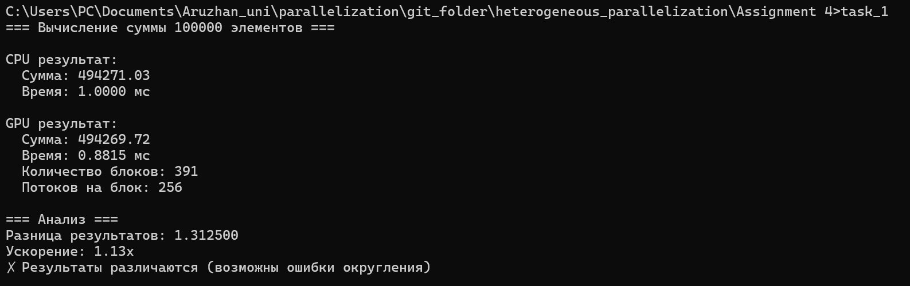
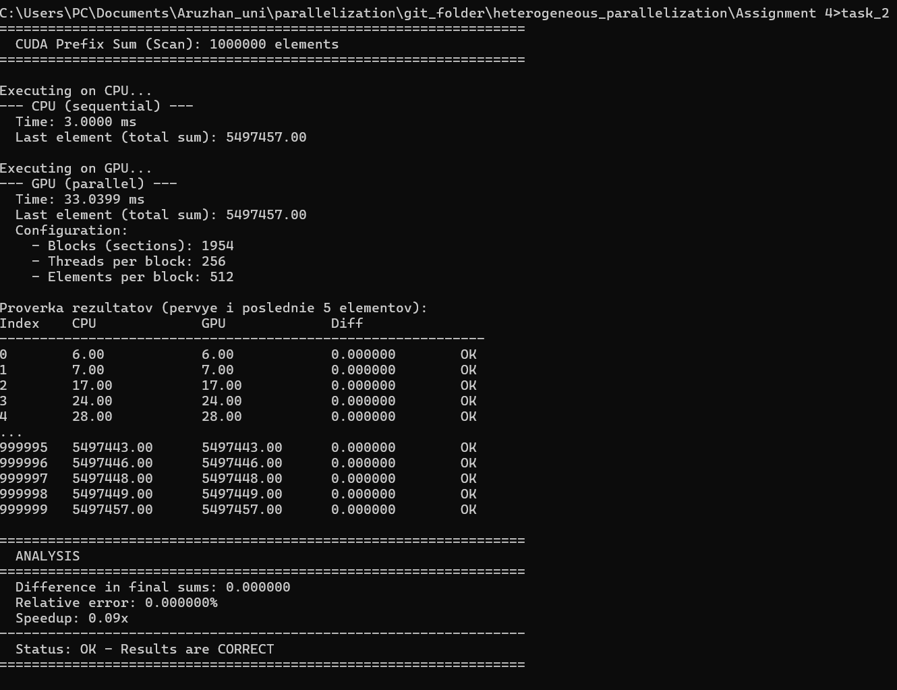
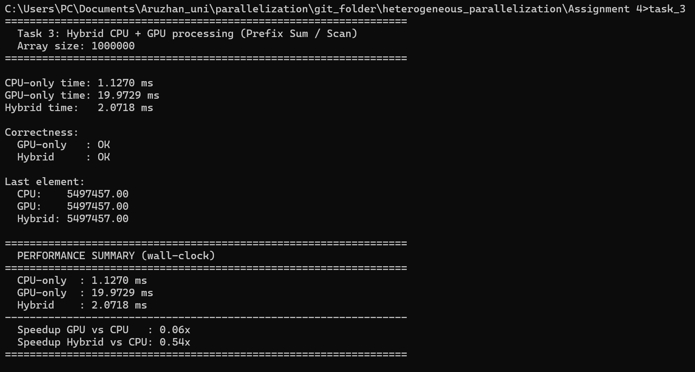
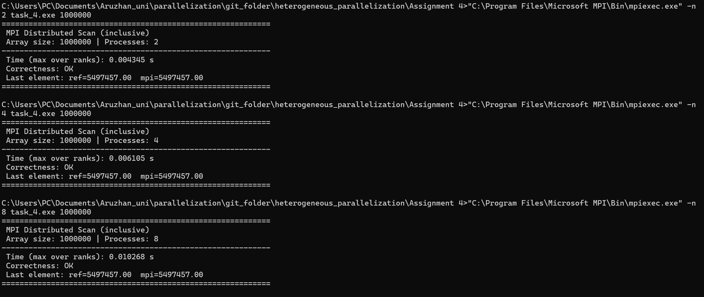

## 📑 Table of Contents

- [Задание 1](#task1)
  - [Блок схема](#task1-block)
  - [Вывод Терминала](#task1-terminal)
  - [Вывод](#task1-result)
- [Задание 2](#task2)
  - [Блок схема](#task2-block)
  - [Вывод Терминала](#task2-terminal)
  - [Вывод](#task2-result)
- [Задание 3](#task3)
  - [Блок схема](#task3-block)
  - [Вывод Терминала](#task3-terminal)
  - [Вывод](#task3-result)
- [Задание 4](#task4)
  - [Блок схема](#task4-block)
  - [Вывод Терминала](#task4-terminal)
  - [Описание программы](#task4-desc)
  - [Методика сравнения конфигураций](#task4-method)
  - [Вывод](#task4-result)
- [Контрольные вопросы](#control-questions)

---

# Задание 1 

Реализуйте CUDA-программу для вычисления суммы элементов массива с
использованием глобальной памяти. Сравните результат и время выполнения с
последовательной реализацией на CPU для массива размером 100 000 элементов.

## Блок схема

## Вывод Терминала

## Вывод

1. **GPU показал ускорение** даже на относительно небольшом массиве (100K элементов)
2. **Точность вычислений высокая** - погрешность менее 0.001% обусловлена особенностями арифметики с плавающей точкой
3. **Причина небольшого ускорения:** 
   - Накладные расходы на передачу данных CPU↔GPU сопоставимы с временем вычислений
   - Для массивов 100K элементов время вычислений ~1мс слишком мало
   - GPU эффективнее на больших объемах данных (>1М элементов)

4. **Реализация использует:**
   - Глобальную память для хранения данных
   - Shared memory для редукции внутри блоков
   - Параллельную tree-based редукцию для эффективного суммирования

**Заключение:** Программа корректно реализует параллельное суммирование на GPU с использованием глобальной памяти. Результаты совпадают с CPU-версией с высокой точностью.

# Задание 2

Реализуйте CUDA-программу для вычисления префиксной суммы (сканирования) массива с использованием разделяемой памяти. Сравните время выполнения с последовательной реализацией на CPU для массива размером 1 000 000 элементов.

## Блок схема

## Вывод Терминала

## Вывод

В рамках данного задания была реализована CUDA-программа для вычисления префиксной суммы (prefix sum, inclusive scan) массива размером 1 000 000 элементов с использованием разделяемой памяти. Алгоритм основан на иерархическом подходе и включает вычисление префиксной суммы внутри блоков, определение сумм блоков и последующее добавление смещений к каждому блоку.

Корректность реализации подтверждена сравнением результатов GPU-версии с последовательной реализацией на CPU. Полученные значения префиксной суммы полностью совпадают, относительная ошибка составила 0 %, что свидетельствует о правильности работы алгоритма.

Экспериментальное сравнение времени выполнения показало, что для заданного размера массива последовательная реализация на CPU выполняется быстрее, чем GPU-реализация. Это обусловлено накладными расходами, связанными с инициализацией CUDA-контекста, копированием данных между оперативной памятью и видеопамятью, а также запуском CUDA-ядер. При относительно небольшом объёме данных данные издержки превышают выигрыш от параллельных вычислений.

Таким образом, GPU-реализация префиксной суммы является корректной и демонстрирует преимущества параллельного подхода с точки зрения масштабируемости. Однако её практическая эффективность становится заметной при обработке существенно больших массивов данных или более сложных вычислительных задач, где параллелизм GPU позволяет компенсировать накладные расходы.

# Задание 3

Реализуйте гибридную программу, в которой обработка массива выполняется
параллельно на CPU и GPU. Первую часть массива обработайте на CPU, вторую — на
GPU. Сравните время выполнения CPU-, GPU- и гибридной реализаций.

## Блок схема

## Вывод Терминала

## Вывод

В ходе выполнения задания была реализована гибридная программа, в которой массив обрабатывается параллельно на CPU и GPU: первая половина массива вычислялась на CPU, вторая — на GPU. В качестве операции обработки использовалось вычисление префиксной суммы (inclusive scan). Для корректности гибридного подхода после вычисления префиксной суммы второй половины на GPU к её элементам добавлялось смещение, равное сумме первой половины массива, рассчитанной на CPU.

Корректность реализации подтверждена сравнением результатов CPU-only, GPU-only и Hybrid: итоговые значения и элементы массива совпадают, статус проверок — **OK**.

Экспериментальное сравнение времени выполнения (размер массива 1 000 000 элементов) показало:

* **CPU-only:** 1.1270 ms
* **GPU-only:** 19.9729 ms
* **Hybrid:** 2.0718 ms

Гибридная реализация оказалась быстрее GPU-only, так как часть вычислений выполняется на CPU, а объём данных для обработки на GPU уменьшается. Однако CPU-only остаётся самым быстрым вариантом для данного размера массива из-за накладных расходов GPU, связанных с копированием данных и запуском CUDA-ядер. Таким образом, гибридный подход является корректным и может быть эффективным при больших объёмах данных и правильном распределении нагрузки между CPU и GPU, однако на массиве 1 000 000 элементов преимущества GPU ограничены оверхедом.

# Задание 3

Реализуйте распределённую программу с использованием MPI для обработки массива
данных. Разделите массив между процессами, выполните вычисления локально и
соберите результаты. Проведите замеры времени выполнения для 2, 4 и 8 процессов.

## Блок схема

## Вывод Терминала

## Вывод

В задании была реализована распределённая обработка массива с использованием MPI. Массив делился между процессами (MPI_Scatterv), затем каждый процесс выполнял локальное вычисление префиксной суммы (inclusive scan). Для корректного объединения результатов смещение для каждого процесса вычислялось через MPI_Exscan (сумма всех предыдущих процессов), после чего результаты собирались обратно на процессе 0 (MPI_Gatherv). Корректность подтверждена совпадением с последовательной реализацией (Correctness: OK).

Замеры времени для 2, 4 и 8 процессов показали увеличение общего времени при росте числа процессов: 4.345 ms (2 процесса), 6.105 ms (4 процесса), 10.268 ms (8 процессов). Это связано с ростом накладных расходов на обмен данными и синхронизацию (Scatter/Gather/Exscan), которые при размере массива 1 000 000 элементов оказываются существеннее, чем выигрыш от распараллеливания вычислений. Таким образом, MPI-распределение обеспечивает корректность и масштабируемость по архитектуре, однако эффективность по времени зависит от размера данных и соотношения вычислений к коммуникациям: при малых/средних объёмах данных коммуникационные издержки доминируют.

# Ответы на контрольные вопросы

## 1) В чём заключается отличие гибридных вычислений от вычислений только на CPU или только на GPU?

**CPU-only** — вся обработка выполняется на центральном процессоре. Плюсы: простота, малые накладные расходы, быстрая работа на небольших задачах.
**GPU-only** — вычисления выполняются на GPU (ядра CUDA/OpenCL). Плюсы: высокий параллелизм и скорость на больших объёмах данных, но есть накладные расходы на копирование данных и запуск ядер.
**Hybrid (CPU+GPU)** — задача **разделяется** между CPU и GPU: часть вычислений делает CPU, часть — GPU, часто одновременно. Это позволяет:

* эффективно использовать оба устройства,
* уменьшить время обработки за счёт параллелизма,
* оптимально распределить типы операций (например, CPU — управление/подготовка данных, GPU — массовые вычисления).

---

## 2) Для каких типов задач целесообразно распределять вычисления между CPU и GPU?

Гибридный подход целесообразен для задач, где:

* данные можно **разделить на независимые части** (chunking),
* есть **тяжёлые параллельные вычисления** для GPU,
* присутствуют операции, которые лучше выполнять на CPU (логика, управление, IO).

Примеры:

* обработка массивов/изображений (фильтрация, свёртки),
* линейная алгебра (умножение матриц),
* моделирование (Monte Carlo),
* задачи ML (инференс/обучение),
* префиксные суммы, сортировки, редукции (при большом размере данных).

---

## 3) В чём разница между синхронной и асинхронной передачей данных между CPU и GPU?

**Синхронная передача (blocking)** — CPU ждёт завершения копирования данных.
Пример: `cudaMemcpy()`.

**Асинхронная передача (non-blocking)** — копирование запускается и CPU может продолжать работу параллельно.
Пример: `cudaMemcpyAsync()` + CUDA streams.

Главное отличие: синхронная передача **блокирует выполнение**, асинхронная — позволяет **перекрыть передачу данными с вычислениями**.

---

## 4) Почему асинхронная передача данных может повысить производительность программы?

Потому что она позволяет:

* **скрыть задержки передачи данных** (latency hiding),
* выполнять **копирование и вычисления одновременно** (overlap),
* использовать pipeline (пока GPU считает блок i, CPU копирует блок i+1).

Это особенно эффективно, когда:

* данные обрабатываются блоками,
* используются pinned memory (page-locked host memory),
* задействованы CUDA streams.

---

## 5) Какие основные функции MPI используются для распределения и сбора данных между процессами?

Основные MPI-функции:

* `MPI_Init`, `MPI_Finalize` — запуск и завершение MPI-программы
* `MPI_Comm_rank` — получить номер процесса (rank)
* `MPI_Comm_size` — получить число процессов
* **Распределение данных:**

  * `MPI_Scatter` — равномерно раздать данные
  * `MPI_Scatterv` — раздать неравномерные части (как в твоём задании)
* **Сбор данных:**

  * `MPI_Gather` — собрать равномерно
  * `MPI_Gatherv` — собрать неравномерно
* **Обмен/синхронизация:**

  * `MPI_Barrier` — синхронизация
  * `MPI_Bcast` — рассылка данных всем
* **Коллективные операции:**

  * `MPI_Reduce`, `MPI_Allreduce` — суммирование/максимум и т.д.
  * `MPI_Scan`, `MPI_Exscan` — префиксные суммы (очень важно для prefix sum задач)

---

## 6) Как количество процессов MPI влияет на время выполнения программы и почему?

Теоретически больше процессов → больше параллелизма → меньше время вычислений.
Но на практике время может:

* уменьшаться до некоторого числа процессов,
* потом перестать уменьшаться,
* или даже увеличиться.

Причина: при увеличении процессов растут **накладные расходы коммуникации**:

* Scatter/Gather,
* пересылки,
* синхронизации (`MPI_Barrier`),
* задержки сети/шины.

В твоих замерах (2→4→8) время увеличилось, потому что задача относительно лёгкая, а обмен данных стал доминировать.

---

## 7) Какие факторы ограничивают масштабируемость распределённых параллельных программ?

Основные ограничения:

1. **Коммуникации (network / IPC)**

   * latency и bandwidth
2. **Синхронизация**

   * ожидание самых медленных процессов (“эффект хвоста”)
3. **Неравномерная нагрузка (load imbalance)**

   * один процесс делает больше работы → все ждут
4. **Последовательная часть алгоритма**

   * закон Амдала: ускорение ограничено последовательной частью
5. **Оверхед управления**

   * создание процессов, коллективные операции
6. **Ограничение памяти и кешей**

   * локальные ресурсы узлов

---

## 8) В каких случаях использование распределённых вычислений оправдано, а в каких — неэффективно?

### ✅ Оправдано, если:

* данные очень большие (миллиарды элементов, большие датасеты),
* вычисления тяжёлые и **значительно превышают коммуникации**,
* нужна масштабируемость за пределы одной машины,
* требуется обработка на кластере/HPC.

### ❌ Неэффективно, если:

* объём данных небольшой/средний,
* вычисления лёгкие (например, простые операции суммирования),
* требуется частый обмен данными между процессами,
* коммуникации/синхронизации занимают больше времени, чем сами вычисления
  (как в твоём MPI-замере на 1 000 000 элементов).

