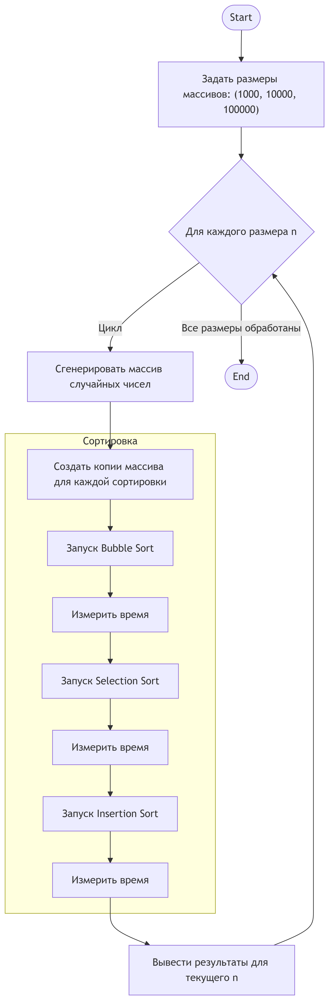
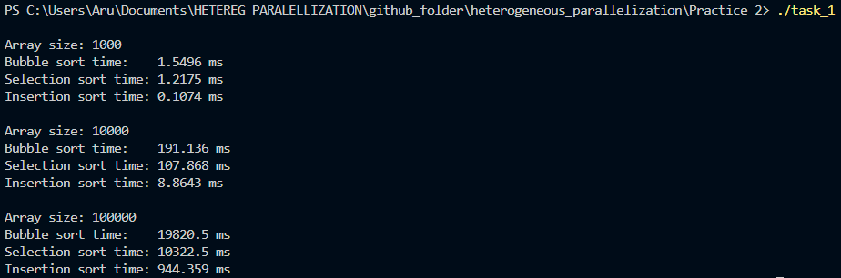
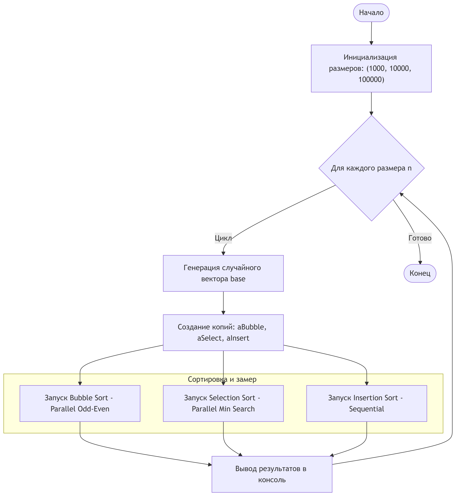
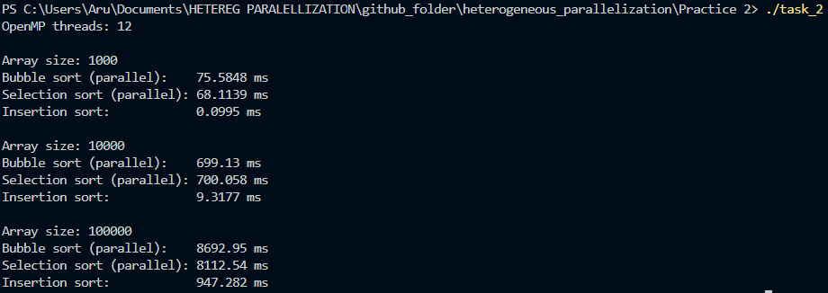
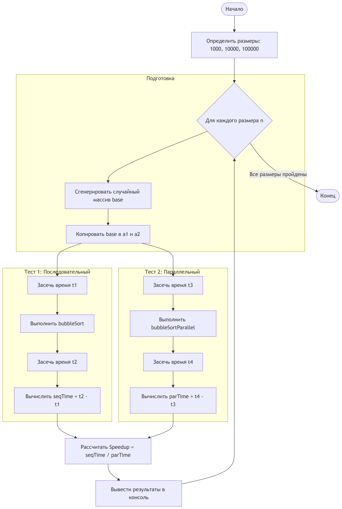
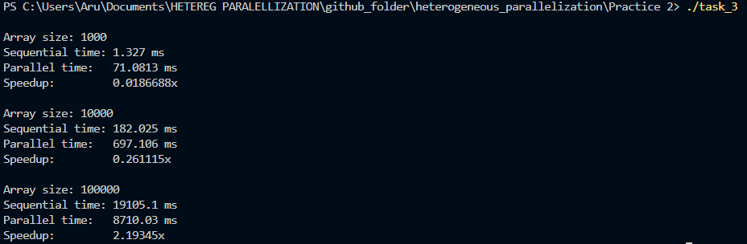

# Практическая работа №2  
## Параллельная реализация простых алгоритмов сортировки с OpenMP

**Student: Aruzhan Imasheva**

**Group: ADA-2404M**
---

## 📑 Содержание

1. [Тема работы](#-тема-работы)
2. [Цель работы](#-цель-работы)
3. [Структура директории](#-структура-директории)
4. [Краткое описание заданий](#-краткое-описание-заданий)
   1. [Задание 1 — Сортировка пузырьком](#-задание-1--сортировка-пузырьком)
   2. [Задание 2 — Сортировка выбором](#-задание-2--сортировка-выбором)
   3. [Задание 3 — Сортировка вставкой](#-задание-3--сортировка-вставкой)
5. [Используемые технологии](#-используемые-технологии)
6. [Компиляция и запуск](#-компиляция-и-запуск)
7. [Выводы](#-выводы)
8. [Итог](#-итог)
9. [Контрольные вопросы и ответы](#-контрольные-вопросы-и-ответы)


## 📌 Тема работы

Параллельная реализация простых алгоритмов сортировки  
(**пузырьком, выбором, вставкой**) на CPU с использованием **OpenMP**.

---

## 🎯 Цель работы

- Освоить основы параллельного программирования на CPU с использованием OpenMP  
- Реализовать классические алгоритмы сортировки:
  - пузырьком (Bubble Sort)
  - выбором (Selection Sort)
  - вставкой (Insertion Sort)
- Сравнить производительность последовательных и параллельных реализаций  
- Проанализировать влияние параллелизма на время выполнения алгоритмов

---

## 📂 Структура директории

```

Practice 2/
│
├── task_1.cpp                     # Сортировка пузырьком
├── task_2.cpp                     # Сортировка выбором
├── task_3.cpp                     # Сортировка вставкой
│
├── block_schema_task_1.png        # Блок-схема алгоритма (Bubble Sort)
├── block_schema_task_2.png        # Блок-схема алгоритма (Selection Sort)
├── block_schema_task_3.png        # Блок-схема алгоритма (Insertion Sort)
│
├── terminal_output_task_1.png     # Вывод программы (task_1)
├── terminal_output_task_2.png     # Вывод программы (task_2)
├── terminal_output_task_3.png     # Вывод программы (task_3)
│
└── README.md                      # Описание практической работы

````

---

## 🧠 Краткое описание заданий

### 🔹 Задание 1 — Сортировка пузырьком
Реализация алгоритма сортировки пузырьком с возможностью параллельного
выполнения с использованием директив OpenMP.

📊 **Блок-схема алгоритма:**



🖥 **Результат выполнения программы:**



---

### 🔹 Задание 2 — Сортировка выбором
Реализация сортировки выбором с распараллеливанием поиска минимального элемента
на каждой итерации внешнего цикла.

📊 **Блок-схема алгоритма:**



🖥 **Результат выполнения программы:**



---

### 🔹 Задание 3 — Сортировка вставкой
Реализация алгоритма сортировки вставкой. Алгоритм в основном является
последовательным, что демонстрирует ограничения параллелизма для данного метода.

📊 **Блок-схема алгоритма:**



🖥 **Результат выполнения программы:**



---

## ⚙️ Используемые технологии

- Язык программирования: **C++**
- Параллельное программирование: **OpenMP**
- Измерение времени выполнения: `<chrono>`
- Компилятор: `g++` с флагом `-fopenmp`

---

## ▶️ Компиляция и запуск

Пример компиляции (для Windows / Linux):

```bash
g++ task_1.cpp -fopenmp -O2 -o task_1
./task_1
````

Аналогично для `task_2.cpp` и `task_3.cpp`.

---

## 📈 Выводы

* Простые алгоритмы сортировки имеют сложность `O(n²)` и плохо масштабируются
  при увеличении размера массива
* Параллельная версия не всегда работает быстрее последовательной из-за:

  * накладных расходов на создание потоков
  * зависимости между итерациями
* OpenMP наиболее эффективно работает для задач с независимыми вычислениями


---

## ✅ Итог

В ходе практической работы были реализованы и проанализированы
последовательные и параллельные версии базовых алгоритмов сортировки,
что позволило на практике изучить возможности и ограничения
параллельного программирования на CPU с использованием OpenMP.


---

## ❓ Контрольные вопросы и ответы

### 1. В чём основные отличия алгоритмов сортировки пузырьком, выбором и вставкой?

- **Сортировка пузырьком** многократно сравнивает соседние элементы и
  «выталкивает» наибольший элемент в конец массива.
- **Сортировка выбором** на каждом шаге находит минимальный элемент
  и помещает его в начало неотсортированной части массива.
- **Сортировка вставкой** поэтапно вставляет каждый новый элемент
  в уже отсортированную часть массива.

Все три алгоритма имеют временную сложность `O(n²)`, но отличаются
количеством операций сравнения и перемещения элементов.

---

### 2. Почему параллельная реализация сортировки вставкой сложнее для выполнения с использованием OpenMP?

Сортировка вставкой имеет **жёсткую зависимость между итерациями**:
каждый следующий шаг зависит от результатов предыдущего.
Из-за этого невозможно эффективно распараллелить основной цикл без
нарушения корректности алгоритма, что делает её плохо подходящей
для OpenMP.

---

### 3. Какие директивы OpenMP были использованы для параллельной реализации алгоритмов?

В практической работе использовались следующие директивы OpenMP:

- `#pragma omp parallel for` — для распараллеливания циклов
- `#pragma omp parallel` — для создания параллельной области
- `omp_get_wtime()` или `<chrono>` — для измерения времени выполнения

---

### 4. Какие преимущества и недостатки параллельной реализации алгоритмов сортировки на CPU?

**Преимущества:**
- Возможность ускорения выполнения на многоядерных процессорах
- Более эффективное использование вычислительных ресурсов CPU

**Недостатки:**
- Накладные расходы на создание и синхронизацию потоков
- Не все алгоритмы эффективно распараллеливаются
- При малых размерах массива параллельная версия может быть медленнее

---

### 5. Как можно измерить производительность программы в C++?

Производительность можно измерить с помощью:

- библиотеки `<chrono>`:
  - `std::chrono::high_resolution_clock`
  - `std::chrono::duration`
- функции `omp_get_wtime()` из OpenMP

Измеряется время выполнения ключевых участков кода
(последовательных и параллельных версий).

---

### 6. Как изменяется производительность сортировок при увеличении числа потоков?

При увеличении числа потоков:
- время выполнения может уменьшаться до определённого предела
- после этого ускорение снижается из-за накладных расходов
- при слишком большом числе потоков возможно ухудшение производительности

Эффект зависит от размера массива и структуры алгоритма.

---

### 7. В каких ситуациях параллельная сортировка может быть менее эффективной, чем последовательная?

Параллельная сортировка может быть менее эффективной, если:
- размер массива слишком мал
- алгоритм имеет сильные зависимости между шагами
- накладные расходы на управление потоками превышают выигрыш от параллелизма
- система имеет ограниченное количество ядер CPU


