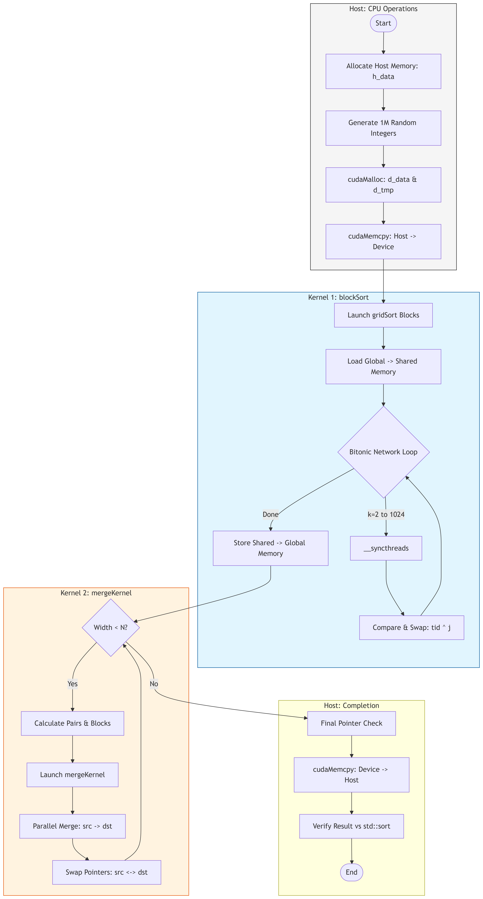
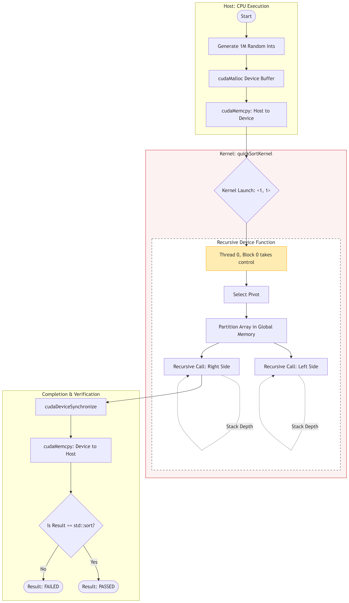
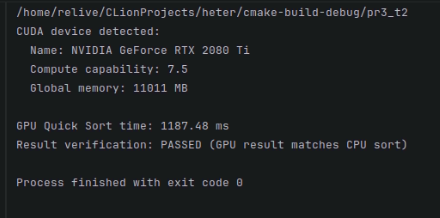
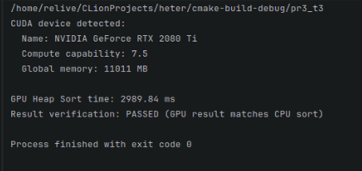
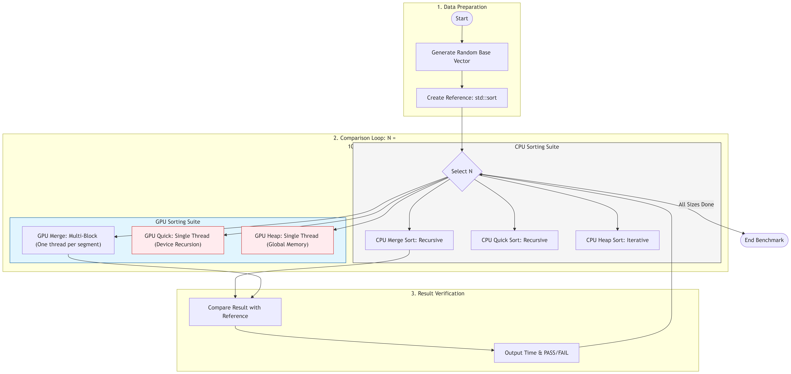

# Практическая работа №3 
## Параллельная реализация простых алгоритмов сортировки с OpenMP

**Student: Aruzhan Imasheva**

**Group: ADA-2404M**
---

## 📑 Содержание

1. [Тема работы](#-тема-работы)
2. [Цель работы](#-цель-работы)
3. [Структура директории](#-структура-директории)
4. [Краткое описание заданий](#-краткое-описание-заданий)
   4.1. [Задание 1 — Параллельная сортировка слиянием (Merge Sort)](#-задание-1--параллельная-сортировка-слиянием-merge-sort)
   4.2. [Задание 2 — Параллельная быстрая сортировка (Quick Sort)](#-задание-2--параллельная-быстрая-сортировка-quick-sort)
   4.3. [Задание 3 — Параллельная пирамидальная сортировка (Heap Sort)](#-задание-3--параллельная-пирамидальная-сортировка-heap-sort)
   4.4. [Задание 4 — Сравнение производительности CPU и GPU](#-задание-4--сравнение-производительности-cpu-и-gpu)
5. [Контрольные вопросы](#контрольные-вопросы)
   5.1. [Различие между последовательной и параллельной сортировкой слиянием](#1-в-чём-различие-между-последовательной-и-параллельной-реализациями-сортировки-слиянием)
   5.2. [Влияние распределения потоков и блоков на производительность CUDA](#2-как-распределение-потоков-и-блоков-влияет-на-производительность-на-cuda)
   5.3. [Сложности реализации быстрой сортировки на GPU](#3-какие-сложности-возникают-при-реализации-быстрой-сортировки-на-gpu)
   5.4. [Когда GPU-сортировка может быть менее эффективной CPU](#4-в-каких-случаях-параллельная-реализация-сортировки-на-gpu-может-быть-менее-эффективной-чем-на-cpu)
   5.5. [Выбор размера блоков и потоков в CUDA](#5-почему-важно-правильно-выбирать-размер-блоков-и-потоков-в-cuda)
   5.6. [Влияние разделяемой памяти на производительность](#6-как-использование-разделяемой-памяти-может-повлиять-на-производительность-сортировки)
   5.7. [Принцип «разделяй и властвуй»](#7-что-означает-принцип-разделяй-и-властвуй-в-контексте-алгоритмов-сортировки)
6. [Вывод](#вывод)


#📌 Примечание по среде выполнения

Данная практическая работа выполнялась на рабочем компьютере, а не на личном ноутбуке студента.
Это связано с тем, что для реализации и тестирования алгоритмов сортировки на GPU требовалось наличие дискретного графического процессора с поддержкой технологии CUDA.

Личный ноутбук не оснащён CUDA-совместимым GPU, поэтому использование рабочего компьютера было необходимым техническим условием для корректного выполнения и проверки параллельных реализаций алгоритмов.
---
## 📌 Тема работы
**Реализация более сложных алгоритмов сортировки (слияние, быстрая, пирамидальная)  
на GPU с использованием технологии CUDA**

---

## 🎯 Цель работы

- Освоить основы программирования на **CUDA** и принципы параллельных вычислений на GPU.
- Реализовать и оптимизировать **сложные алгоритмы сортировки** на GPU:
  - сортировку слиянием;
  - быструю сортировку;
  - пирамидальную сортировку.
- Исследовать производительность алгоритмов на GPU и **сравнить её с реализациями на CPU**.

---


## 📂 Структура директории

```
Practice 3/
│
├── pr3_t1.cu # Задание 1: Параллельная сортировка слиянием (CUDA)
├── pr3_t2.cu # Задание 2: Параллельная быстрая сортировка (CUDA)
├── pr3_t3.cu # Задание 3: Параллельная пирамидальная сортировка (CUDA)
├── pr3_t4.cu # Задание 4: Сравнение производительности CPU и GPU
│
├── CMakeLists.txt # CMake-конфигурация для сборки CUDA-проектов
│
├── block_schema_task_1.png # Блок-схема для задания 1 (Merge Sort)
├── block_schema_task_2.png # Блок-схема для задания 2 (Quick Sort)
├── block_schema_task_3.png # Блок-схема для задания 3 (Heap Sort)
├── block_schema_task_4.png # Блок-схема для задания 4 (Сравнение CPU vs GPU)
│
├── terminal_output_task_1.png # Вывод программы для задания 1
├── terminal_output_task_2.png # Вывод программы для задания 2
├── terminal_output_task_3.png # Вывод программы для задания 3
├── terminal_output_task_4.png # Вывод программы для задания 4
│
└── README.md # Описание практической работы №3

````

## 🧠 Краткое описание заданий

---

### 🔹 Задание 1 — Параллельная сортировка слиянием (Merge Sort)

**Файл:** `pr3_t1.cu`  

Реализована параллельная сортировка слиянием на GPU с использованием технологии CUDA.  
Массив разбивается на блоки, каждый из которых сортируется параллельно отдельным блоком потоков.  
На последующих этапах выполняется поэтапное слияние отсортированных подмассивов.  
Для ускорения работы активно используется разделяемая память CUDA.

**Блок-схема алгоритма:**



**Вывод программы (терминал):**


---

### 🔹 Задание 2 — Параллельная быстрая сортировка (Quick Sort)

**Файл:** `pr3_t2.cu`  

Реализована параллельная версия быстрой сортировки на GPU.  
Алгоритм использует опорный элемент для разбиения массива на подмассивы, которые обрабатываются параллельными потоками.  
При реализации учитываются ограничения GPU, связанные с ветвлением потоков и нерегулярным доступом к памяти.

**Блок-схема алгоритма:**



**Вывод программы (терминал):**



---

### 🔹 Задание 3 — Параллельная пирамидальная сортировка (Heap Sort)

**Файл:** `pr3_t3.cu`  

Реализована пирамидальная сортировка с использованием CUDA.  
В ходе работы формируется бинарная куча, после чего последовательно извлекается максимальный элемент с перестройкой структуры кучи.  
Часть операций выполняется параллельно, где это возможно с точки зрения алгоритма.

**Блок-схема алгоритма:**


**Вывод программы (терминал):**



---

### 🔹 Задание 4 — Сравнение производительности CPU и GPU

**Файл:** `pr3_t4.cu`  

Выполнено сравнение времени выполнения последовательных реализаций сортировок на CPU и параллельных реализаций на GPU.  
Измерения проводятся для массивов различного размера, что позволяет оценить эффективность применения GPU для задач сортировки.

**Блок-схема алгоритма:**



**Вывод программы (терминал):**


# Контрольные вопросы

---

### 1. В чём различие между последовательной и параллельной реализациями сортировки слиянием?

**Последовательная сортировка слиянием (Merge Sort)**:
- Работает по принципу «разделяй и властвуй»:
  - массив рекурсивно делится на две части;
  - каждая часть сортируется;
  - затем отсортированные части сливаются.
- Все операции выполняются **одним потоком**.
- Производительность ограничена вычислительной мощностью одного CPU-ядра.
- Временная сложность: `O(n log n)`.

**Параллельная сортировка слиянием**:
- Разделение массива и сортировка подмассивов выполняются **одновременно** в нескольких потоках.
- На GPU:
  - разные блоки потоков сортируют разные части массива;
  - этап слияния также может быть распараллелен.
- Позволяет существенно сократить время выполнения для больших массивов.
- Требует синхронизации и дополнительного управления памятью.

**Основное отличие** — использование параллелизма (много потоков вместо одного).

---

### 2. Как распределение потоков и блоков влияет на производительность на CUDA?

Распределение потоков и блоков напрямую определяет:
- уровень параллелизма;
- загрузку GPU;
- эффективность использования памяти.

Ключевые моменты:
- **Недостаточное число потоков** → GPU простаивает.
- **Слишком большое число потоков** → повышенные накладные расходы.
- Размер блока влияет на:
  - использование разделяемой памяти;
  - количество активных блоков на SM (Streaming Multiprocessor).
- Оптимальный размер блока обычно кратен размеру warp (32 потока).

Неправильное распределение может привести к:
- снижению пропускной способности памяти;
- увеличению времени выполнения;
- неэффективному использованию вычислительных ресурсов GPU.

---

### 3. Какие сложности возникают при реализации быстрой сортировки на GPU?

Быстрая сортировка (Quick Sort) плохо подходит для GPU по следующим причинам:

1. **Нерегулярный доступ к памяти**  
   - элементы переставляются хаотично;
   - возникают некоалесцированные обращения к памяти.

2. **Разветвления (branch divergence)**  
   - разные потоки одного warp выполняют разные ветви условий;
   - снижает эффективность SIMD-исполнения.

3. **Рекурсия**  
   - GPU плохо поддерживает рекурсивные алгоритмы;
   - требует сложной имитации через циклы или стеки.

4. **Несбалансированная нагрузка**  
   - подмассивы могут сильно различаться по размеру;
   - часть потоков простаивает.

Поэтому на GPU чаще используют:
- bitonic sort;
- merge sort;
- radix sort.

---

### 4. В каких случаях параллельная реализация сортировки на GPU может быть менее эффективной, чем на CPU?

Параллельная сортировка на GPU может проигрывать CPU, если:

- размер массива **малый** (накладные расходы выше выигрыша);
- требуется частая передача данных между CPU и GPU (PCIe);
- алгоритм плохо распараллеливается;
- используется неоптимальный размер блоков;
- CPU имеет высокую тактовую частоту и эффективный кэш.

Для небольших объёмов данных **последовательная или OpenMP-реализация на CPU** часто оказывается быстрее.

---

### 5. Почему важно правильно выбирать размер блоков и потоков в CUDA?

Правильный выбор размера блоков и потоков позволяет:
- максимально загрузить GPU;
- эффективно использовать shared memory;
- минимизировать задержки доступа к памяти.

Неправильный выбор может привести к:
- снижению occupancy;
- нехватке регистров или shared memory;
- ухудшению производительности.

Обычно:
- размер блока выбирают в диапазоне **128–1024 потоков**;
- кратно 32 (размер warp).

---

### 6. Как использование разделяемой памяти может повлиять на производительность сортировки?

**Разделяемая память (shared memory)**:
- находится на кристалле GPU;
- значительно быстрее глобальной памяти.

Преимущества:
- ускоряет сортировку внутри блока;
- снижает количество обращений к глобальной памяти;
- позволяет реализовывать эффективные алгоритмы (например, bitonic sort).

Ограничения:
- небольшой объём;
- требуется явная синхронизация потоков (`__syncthreads()`).

Правильное использование shared memory может дать **кратный прирост производительности**.

---

### 7. Что означает принцип «разделяй и властвуй» в контексте алгоритмов сортировки?

Принцип «разделяй и властвуй» означает:

1. **Разделение**  
   - исходная задача разбивается на меньшие подзадачи.

2. **Владствование (решение)**  
   - каждая подзадача решается независимо.

3. **Объединение**  
   - результаты объединяются в итоговое решение.

В сортировках:
- merge sort делит массив и затем сливает части;
- quick sort делит массив относительно опорного элемента.

Этот принцип особенно хорошо подходит для **параллельных вычислений**, так как подзадачи можно выполнять одновременно.

---

**Вывод:**  
Параллельные алгоритмы сортировки на GPU позволяют значительно ускорить обработку больших массивов, однако требуют тщательного выбора алгоритма, параметров CUDA и управления памятью.
