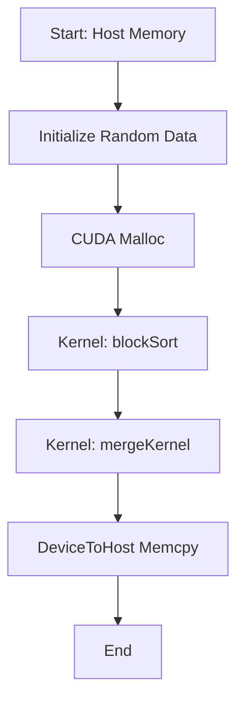

# Практическая работа №3 
## Параллельная реализация простых алгоритмов сортировки с OpenMP

**Student: Aruzhan Imasheva**

**Group: ADA-2404M**
---

# 📑 Содержание

```mermaid
graph TD
    A[Start: Host Memory] --> B[Initialize Random Data]
    B --> C[CUDA Malloc]
    C --> D[Kernel: blockSort]
    D --> E[Kernel: mergeKernel]
    E --> F[DeviceToHost Memcpy]
    F --> G[End]
```

