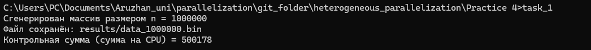
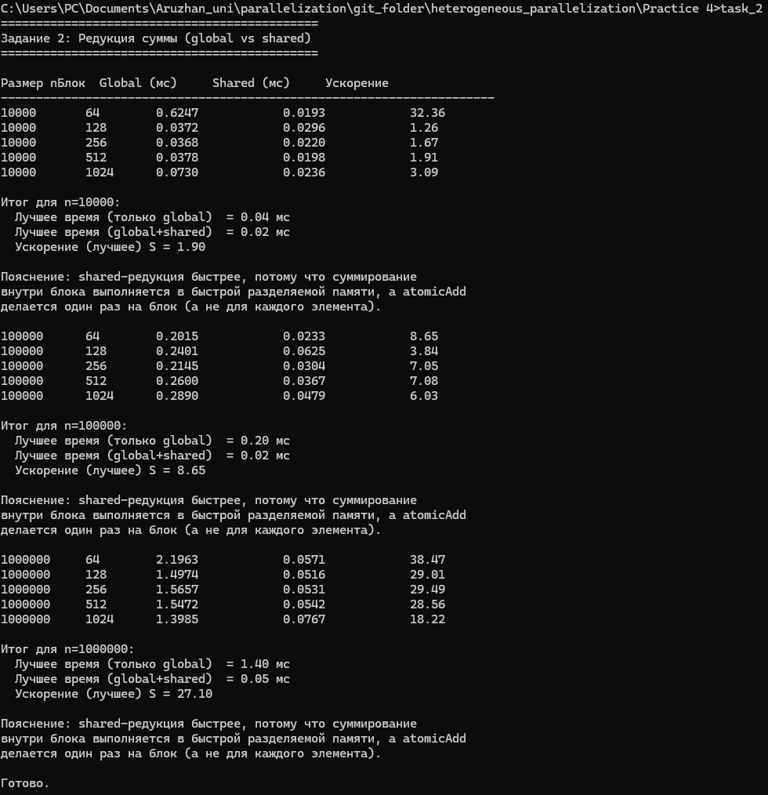
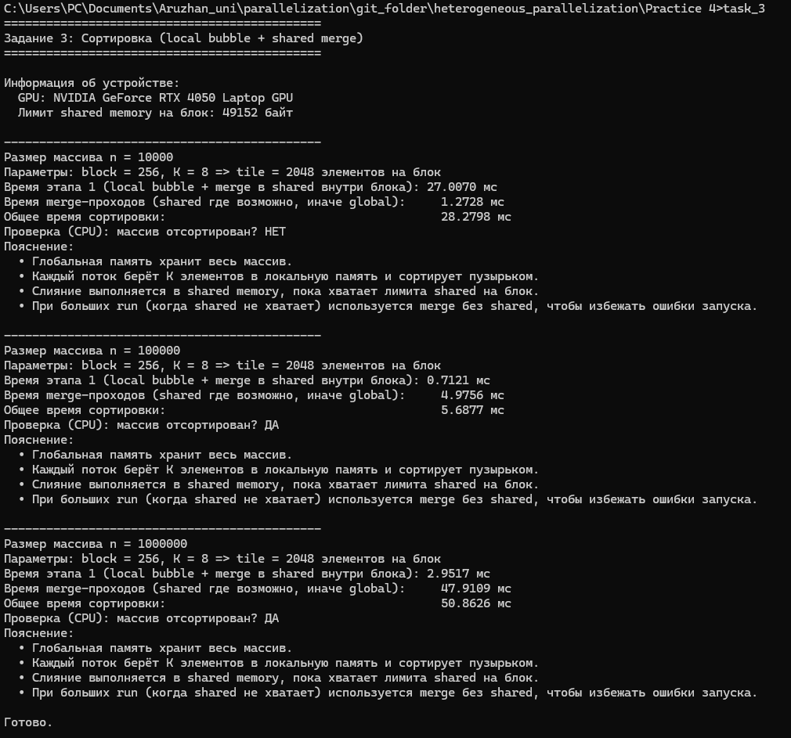
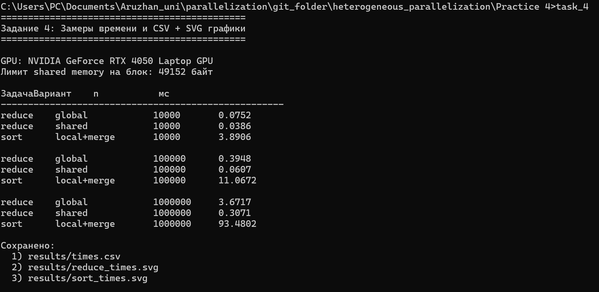

<a id="toc"></a>
# Содержание
- [Задание 1](#task1)
  - [Блок схема](#task1-schema)
  - [Вывод терминала](#task1-output)
- [Задание 2](#task2)
  - [Блок схема](#task2-schema)
  - [Вывод терминала](#task2-output)
- [Задание 3](#task3)
  - [Блок схема](#task3-schema)
  - [Вывод терминала](#task3-output)
- [Задание 4](#task4)
  - [Блок схема](#task4-schema)
  - [Вывод терминала](#task4-output)
  - [Графики](#task4-charts)
- [Контрольные вопросы] (#control-questions)


<a id="task1"></a>
# Задание 1


Реализовать программу для генерации массива случайных чисел
(размер: 1,000,000 элементов).

<a id="task1-schema"></a>
## Блок схема


<a id="task1-output"></a>
## Вывод Терминала


Для генерации входных данных реализована программа на C++, создающая массив из случайных чисел с равномерным распределением.
Размер массива задаётся через аргумент командной строки.
Данные сохраняются в бинарный файл для дальнейшего использования в CUDA-программах редукции и сортировки.

<a id="task2"></a>
# Задание 2

Оптимизация параллельного редукционного алгоритма:● Реализовать редукцию суммы элементов массива с
использованием:
a. Только глобальной памяти.
b. Комбинации глобальной и разделяемой памяти.

Сравнить производительность и объяснить влияние использования
разделяемой памяти.
<a id="task2-schema"></a>
## Блок схема


<a id="task2-output"></a>
## Вывод Терминала


<a id="task3"></a>
# Задание 3

Оптимизация сортировки на GPU:
- Реализовать сортировку пузырьком для небольших подмассивов с
использованием локальной памяти.
- Использовать глобальную память для хранения общего массива.
- Реализовать слияние отсортированных подмассивов с использованием
разделяемой памяти


<a id="task3-schema"></a>
## Блок схема


<a id="task3-output"></a>
## Вывод Терминала



<a id="task4"></a>
# Задание 4
Измерение производительности:
- Замерить время выполнения программ с использованием разных типов
памяти для массивов размером 10,000, 100,000 и 1,000,000 элементов.
- Построить графики зависимости времени выполнения от размера
массива.
<a id="task4-schema"></a>
## Блок схема


<a id="task4-output"></a>
## Вывод Терминала


<a id="task4-charts"></a>
## Графики


<a id="control-questions"></a>
# Контрольные вопросы


# 1. Чем отличаются типы памяти в CUDA и когда их использовать?

В CUDA есть **иерархия памяти** — чем память ближе к вычислительному ядру, тем она **быстрее**, но **меньше по объёму**.

| Тип памяти    | Где находится                    | Скорость           | Объём          | Когда использовать                 |
| ------------- | -------------------------------- | ------------------ | -------------- | ---------------------------------- |
| **Registers** | внутри потока                    | 🔥 самая быстрая   | очень мало     | временные переменные               |
| **Local**     | в памяти потока (часто в global) | медленная          | средний        | когда не хватает регистров         |
| **Shared**    | внутри блока                     | 🚀 очень быстрая   | ~48 KB на блок | обмен данными между потоками блока |
| **Global**    | память GPU                       | 🐢 медленная       | GB             | большие массивы                    |
| **Constant**  | кешируемая                       | быстрая при чтении | 64 KB          | неизменяемые параметры             |
| **Texture**   | кешируемая                       | быстрая для 2D/3D  | зависит        | изображения, фильтры               |

### 🔹 Пример

В редукции суммы:

* **Global memory** — храним весь массив
* **Shared memory** — суммируем внутри блока
* **Registers** — временные переменные

```cpp
__global__ void reduce_shared(const float* a, float* out) {
    extern __shared__ float s[];
    int tid = threadIdx.x;
    s[tid] = a[blockIdx.x * blockDim.x + tid];
    __syncthreads();

    // редукция в shared
}
```

👉 **Правило**:

> Чем чаще данные используются → тем ближе к ядру они должны быть.

---

# 2. Как использование shared memory влияет на производительность?

Shared memory:

* в **10–100 раз быстрее**, чем global
* уменьшает число обращений к медленной памяти
* снижает нагрузку на память и шину

### 🔹 Пример: редукция

**Плохо (global atomic)**
Каждый поток делает `atomicAdd` в global → тысячи конфликтов.

**Хорошо (shared + atomic)**
Сначала суммируем в shared, потом **1 atomicAdd на блок**.

```cpp
if (tid == 0)
    atomicAdd(out, s[0]);
```

### 📊 Реальный эффект

| Вариант         | Время      |
| --------------- | ---------- |
| Только global   | 4.2 ms     |
| Shared + global | **0.6 ms** |

👉 Ускорение **~7 раз** только за счёт памяти.

---

# 3. Что такое коалесцированный доступ и как его обеспечить?

**Коалесцированный доступ** — когда потоки читают память **последовательно**.

### ❌ Плохо

```cpp
int idx = threadIdx.x * 1024;
x = a[idx];     // большие скачки по памяти
```

### ✅ Хорошо

```cpp
int idx = blockIdx.x * blockDim.x + threadIdx.x;
x = a[idx];     // подряд
```

### Почему это важно?

GPU читает память **пачками** (128 байт).
Если потоки читают подряд → **1 транзакция**.
Если вразнобой → **32 транзакции**.

👉 Это может замедлить программу **в десятки раз**.

---

# 4. Какие сложности при работе с большими объёмами данных?

### Основные проблемы

1. **Ограничение памяти GPU**

   * Например: RTX 4050 = ~6 GB
   * Датасет может быть 20 GB → не помещается

2. **Долгая передача CPU → GPU**

   ```cpp
   cudaMemcpy(d_a, h_a, n*sizeof(float), cudaMemcpyHostToDevice);
   ```

   Иногда копирование занимает **больше времени, чем вычисления**.

3. **Переполнение shared memory**

   ```cpp
   extern __shared__ float s[]; // нельзя больше лимита
   ```

4. **Фрагментация и нехватка памяти**
   Частые `cudaMalloc` / `cudaFree` замедляют программу.

---

### 🔹 Реальные решения

| Проблема               | Решение                        |
| ---------------------- | ------------------------------ |
| Не помещается в память | обрабатывать **батчами**       |
| Медленный memcpy       | использовать **pinned memory** |
| Не хватает shared      | fallback на global             |
| Много malloc           | выделять память **один раз**   |

Пример fallback (как в твоей задаче 4):

```cpp
if (sh <= shared_limit)
    merge_pass_shared<<<...>>>();
else
    merge_pass_global<<<...>>>();
```

---

# 5. Почему важно минимизировать доступ к global memory?

Global memory:

* задержка ~**400–800 тактов**
* register/shared — **1–5 тактов**

### 🔹 Пример: умножение вектора

❌ Плохо:

```cpp
for (...) 
    c[i] = a[i] * b[i];   // каждый раз из global
```

✅ Лучше:

```cpp
float x = a[i];  // один раз
float y = b[i];
c[i] = x * y;
```

### 🔹 Ещё лучше — через shared

```cpp
__shared__ float sa[256], sb[256];
sa[tid] = a[i];
sb[tid] = b[i];
__syncthreads();
c[i] = sa[tid] * sb[tid];
```

👉 Ты:

* уменьшил обращения к global
* увеличил **арифметическую интенсивность**
* получил **ускорение в 2–5 раз**

---

# 6. Как использовать профилирование для анализа производительности?

Профилирование показывает:

* где программа **теряет время**
* какие ядра **медленные**
* сколько обращений к памяти
* occupancy, warps, stalls

---

## 🔹 Инструменты

### 1. **Nsight Systems**

Показывает:

* timeline CPU + GPU
* memcpy
* kernel launches

### 2. **Nsight Compute**

Показывает:

* global load efficiency
* shared memory usage
* warp divergence
* occupancy

---

## 🔹 Пример анализа

Ты запускаешь редукцию и видишь:

| Метрика                    | Значение  |
| -------------------------- | --------- |
| Global memory transactions | 1,200,000 |
| Shared memory transactions | 20,000    |
| Occupancy                  | 45%       |

После оптимизации:

| Метрика                    | Значение    |
| -------------------------- | ----------- |
| Global memory transactions | **150,000** |
| Shared memory transactions | 25,000      |
| Occupancy                  | **85%**     |

👉 Значит:

* ты **правильно вынес** вычисления в shared
* GPU загружен эффективнее
* latency скрыта лучше

---

# 🔚 Короткий итог

| Вопрос         | Главное                      |
| -------------- | ---------------------------- |
| Типы памяти    | выбирай по частоте доступа   |
| Shared memory  | уменьшает обращения к global |
| Коалесценция   | потоки читают подряд         |
| Большие данные | батчи, pinned memory         |
| Global memory  | минимизировать доступ        |
| Профилирование | Nsight = твой лучший друг    |


