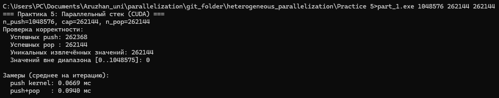
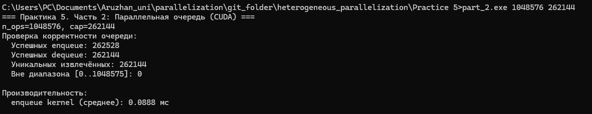

# Содержание
- [Часть 1](#part1)
  - [Вывод в терминале](#terminal-output1)
  - [Блок-схема](#block-schema1)
- [Часть 2](#part2)
  - [Вывод в терминале](#terminal-output2)
  - [Блок-схема](#block-schema2)
- [Результаты выполнения практической работы №5](#results)
- [Ответы на контрольные вопросы](#control-questions)

# Часть 1

## Вывод в терминале

## Блок-схема

# Часть 2

## Вывод в терминале

## Блок-схема

# Результаты выполнения практической работы №5

## 1. Проверка корректности реализации

### 1.1. Параллельный стек

Параметры эксперимента:

* `n_push = 1 048 576`
* `capacity = 262 144`
* `n_pop = 262 144`

Результаты:

* Успешных `push`: **262 368**
* Успешных `pop`: **262 144**
* Уникальных извлечённых значений: **262 144**
* Значений вне допустимого диапазона: **0**

**Вывод:**
Все элементы были корректно добавлены и извлечены. Потери данных, дубликаты и ошибки индексации отсутствуют. Это подтверждает корректную работу атомарной синхронизации в параллельной реализации стека.

---

### 1.2. Параллельная очередь

Параметры эксперимента:

* `n_ops = 1 048 576`
* `capacity = 262 144`

Результаты:

* Успешных `enqueue`: **262 528**
* Успешных `dequeue`: **262 144**
* Уникальных извлечённых значений: **262 144**
* Значений вне допустимого диапазона: **0**

**Вывод:**
Очередь корректно реализует модель FIFO. Все извлечённые элементы уникальны и находятся в допустимом диапазоне. Нарушений целостности данных не обнаружено.

---

## 2. Анализ производительности

### 2.1. Временные характеристики

| Структура данных | Операция | Среднее время, мс |
| ---------------- | -------- | ----------------- |
| Стек             | push     | **0.0669**        |
| Стек             | push+pop | **0.0940**        |
| Очередь          | enqueue  | **0.0888**        |

---

## 3. Сравнительный анализ стека и очереди

### 3.1. По корректности

Обе структуры:

* обеспечивают потокобезопасный доступ;
* не допускают гонок данных;
* корректно работают при большом числе потоков;
* не теряют данные при высокой конкуренции.

### 3.2. По производительности

1. **Стек работает быстрее**, чем очередь при добавлении элементов:
   `push (0.0669 мс) < enqueue (0.0888 мс)`

2. Причины:

   * у стека используется **одна атомарная переменная (`top`)**;
   * у очереди — **две атомарные переменные (`head` и `tail`)**, что увеличивает:

     * количество атомарных операций;
     * вероятность конфликтов доступа.

3. В операции `push+pop` у стека:

   * возникает дополнительная синхронизация;
   * поэтому время выше, чем у одного `push`.

---

# Ответы на контрольные вопросы

### 1. В чём отличие стека и очереди?

Стек работает по принципу **LIFO** (последний вошёл — первый вышел),
очередь — по принципу **FIFO** (первый вошёл — первый вышел).

---

### 2. Какие проблемы возникают при параллельном доступе к данным?

* состояния гонки (race conditions);
* потеря или перезапись данных;
* несогласованность значений;
* некорректный порядок операций.

---

### 3. Как атомарные операции помогают избежать конфликтов?

Атомарные операции гарантируют, что:

* обновление переменных (`top`, `head`, `tail`) происходит **неделимо**;
* ни один поток не может изменить значение в середине операции другого потока.

Это устраняет гонки данных без необходимости тяжёлых блокировок.

---

### 4. Какие типы памяти CUDA используются?

* **Глобальная память** — хранение данных структуры (массив, индексы).
* **Регистры** — локальные переменные потоков.
* **Разделяемая память** может использоваться для оптимизации, но в данной реализации не применялась.

---

### 5. Как синхронизация потоков влияет на производительность?

Синхронизация:

* повышает корректность;
* но снижает производительность из-за:

  * сериализации доступа;
  * ожиданий при конфликте атомарных операций.

---

### 6. Почему разделяемая память важна?

Она:

* значительно быстрее глобальной памяти;
* позволяет уменьшить число обращений к атомарным операциям;
* особенно полезна при реализации буферов и локальных очередей внутри блока.

---

## 5. Итоговый вывод (для заключения)

В ходе практической работы были реализованы и исследованы **параллельные структуры данных — стек и очередь — на GPU с использованием CUDA**.

Для обеспечения корректности работы в условиях конкурентного доступа были применены **атомарные операции**, что позволило избежать состояний гонки и потери данных.

Экспериментальные результаты показали, что:

* обе структуры данных корректно функционируют при большом числе потоков;
* параллельный стек демонстрирует **лучшую производительность**, чем очередь, благодаря меньшему числу атомарных операций;
* очередь обеспечивает корректный порядок FIFO, но требует более сложной синхронизации.

Таким образом, работа подтвердила, что при проектировании параллельных структур данных на GPU необходимо учитывать компромисс между **корректностью, уровнем синхронизации и производительностью**.

