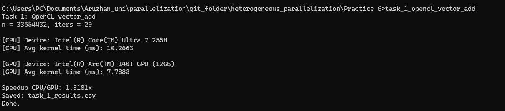
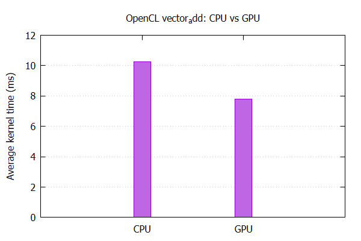
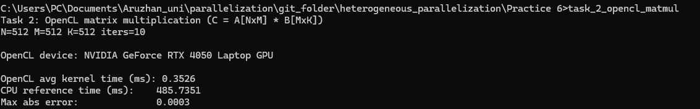

<a id="toc"></a>
# Содержание
- [Задание 1](#task1)
  - [Блок схема](#task1-schema)
  - [Вывод терминала](#task1-output)
  - [Графики](#task1-charts)
- [Задание 2](#task2)
  - [Блок схема](#task2-schema)
  - [Вывод терминала](#task2-output)
- [Контрольные вопросы](#control-questions)


<a id="task1"></a>
# Задание 1

1. Подготовка окружения:
    1. Установите необходимые драйверы для OpenCL на вашей системе.
        a. Для CPU: установите драйверы от производителя процессора
        (Intel, AMD).
        b. Для GPU: установите драйверы от производителя видеокарты
        (NVIDIA, AMD).
    2. Убедитесь, что OpenCL-библиотеки доступны в вашей системе:
        a. Linux: /usr/lib/libOpenCL.so
        b. Windows: OpenCL.dll
    3. Настройте среду разработки (например, VS Code, CLion или Visual
    Studio).


2. Реализация задачи:
Шаг 1. Создайте ядро OpenCL (файл kernel.cl):
Напишите ядро, выполняющее операцию сложения двух массивов:
```
__kernel void vector_add(__global const float* A,
 __global const float* B,
 __global float* C) {
 int id = get_global_id(0); // Определение глобального ID
 C[id] = A[id] + B[id]; // Выполнение операции сложения
}
```

Шаг 2. Создайте программу на C/C++:

Реализуйте программу, которая:
    
1. Инициализирует платформу и устройство OpenCL.

2. Создает контекст и командную очередь.

3. Загружает и компилирует ядро.

4. Подготавливает данные (массивы A, B и C).

5. Выполняет ядро и считывает результаты.

Шаг 3. Выполните программу:
    
1. Скомпилируйте код с использованием OpenCL-библиотеки.

2. Измерьте время выполнения программы на CPU и GPU (например, с
использованием clock() или профилировщиков).


Шаг 4. Сравните производительность:

Сравните производительность выполнения программы на CPU и GPU. Отчет
должен содержать:
    
● Время выполнения на CPU.

● Время выполнения на GPU.

● График сравнения.

<a id="task1-schema"></a>
## Блок схема


<a id="task1-output"></a>
## Вывод Терминала



<a id="task1-charts"></a>

## График сравнения



## Результаты эксперимента (CPU vs GPU)

**Параметры запуска:**

* `n = 33,554,432` ( (2^{25}) элементов)
* `iters = 20` (усреднение по 20 запускам ядра)

### Время выполнения OpenCL-ядра

| Устройство | Device                           | Avg kernel time (ms) |
| ---------- | -------------------------------- | -------------------: |
| CPU        | Intel(R) Core(TM) Ultra 7 255H   |              10.2663 |
| GPU        | Intel(R) Arc(TM) 140T GPU (12GB) |               7.7888 |

### Ускорение

$$
S = \frac{T_{\text{CPU}}}{T_{\text{GPU}}}
= \frac{10.2663}{7.7888}
\approx 1.3181
$$

**Вывод:** GPU выполняет сложение массивов примерно в **1.32 раза быстрее**, чем CPU (для данного размера данных).

---

## Проверка корректности (кратко)

Операция выполняется по формуле:
$$
C[i] = A[i] + B[i]
$$

где $(i = 0 \ldots n-1)$.
Результат после выполнения ядра считывается обратно на host и может быть проверен сравнением с эталонным вычислением на CPU (по нескольким индексам или по всему массиву).

---

## Важное пояснение к замерам

Измеренное время соответствует **времени выполнения OpenCL-ядра** (с синхронизацией `clFinish()`), то есть отражает именно вычислительный этап на выбранном устройстве.


<a id="task2"></a>
# Задание 2

Описание задачи:

Реализуйте программу для параллельного умножения двух матриц с
использованием OpenCL. Матрицы A и B имеют размеры N×M и M×K
соответственно. Программа должна вычислить результирующую матрицу C
размером N×K.

Шаг 1. Создайте ядро OpenCL для матричного умножения:

Шаг 2. Реализуйте программу:

1. Подготовьте матрицы A, B и C.

2. Передайте размеры матриц (N, M, K) в качестве аргументов ядра.

3. Настройте размеры рабочей группы, соответствующие размеру матрицы
C (глобальная рабочая группа).

Шаг 3. Проверьте корректность результатов:Сравните результаты OpenCL с последовательной реализацией матричного
умножения на CPU.

<a id="task2-schema"></a>
## Блок схема


<a id="task2-output"></a>
## Вывод Терминала



## Результаты (OpenCL vs CPU)

**Параметры эксперимента:**  
- `N = 512`, `M = 512`, `K = 512`  
- `iters = 10`  

**Устройство OpenCL:** NVIDIA GeForce RTX 4050 Laptop GPU

### Время выполнения

- OpenCL avg kernel time (ms): **0.3526**  
- CPU reference time (ms): **485.7351**

### Ускорение

$$
S = \frac{T_{\text{CPU}}}{T_{\text{OpenCL}}}
= \frac{485.7351}{0.3526}
\approx 1377.7
$$

**Вывод:** реализация на OpenCL работает примерно в **1377.7 раза быстрее**, чем последовательная CPU-версия (для `512×512`, измерения по времени ядра OpenCL).

---

## Проверка корректности

Максимальная абсолютная ошибка:
- `Max abs error = 0.0003`

**Вывод:** результат OpenCL совпадает с CPU-референсом с очень малой погрешностью (ошибка в пределах **3e-4**), что допустимо для вычислений с `float`.


<a id="control-questions"></a>

# Ответы на контрольные вопросы

### 1) Какие основные типы памяти используются в OpenCL?

* **Global memory** — общая память устройства, доступна всем work-item’ам; большая, но относительно медленная.
* **Local memory** — общая для work-item’ов внутри одной work-group; быстрее, используется для обмена данными внутри группы (аналог shared memory).
* **Private memory** — приватная память одного work-item (обычно регистры/локальные переменные); самая быстрая, но очень ограниченная.
* **Constant memory** — область глобальной памяти только для чтения, оптимизированная под широковещательный доступ (полезно для констант/коэффициентов).

---

### 2) Как настроить глобальную и локальную рабочую группу?

В OpenCL размер запуска задаётся двумя основными параметрами:

* **Global work size** — общее число work-item’ов (размер сетки вычислений).
* **Local work size** — число work-item’ов в одной work-group (размер блока).

Пример (1D):

* `global = N`
* `local = 256`
* обычно делают `global` кратным `local` (или округляют вверх).

Пример (2D для матрицы):

* `global = {K, N}` (по ширине и высоте результата C)
* `local = {16, 16}` или `{8, 8}` (типичные значения)

На практике local size выбирают так, чтобы:

* эффективно использовать вычислительные блоки GPU,
* не превышать лимиты по local memory и размеру work-group,
* обеспечивать удобную обработку тайлами (tiling).

---

### 3) Чем отличается OpenCL от CUDA?

* **CUDA** — платформа/язык от NVIDIA, работает только на NVIDIA GPU, но обычно даёт очень хороший доступ к возможностям их архитектуры и инструментам (Nsight, CUDA libs).
* **OpenCL** — открытый стандарт, поддерживает разные устройства и вендоров (CPU, GPU, иногда FPGA) и позволяет писать более переносимый код.

Коротко:
**CUDA — глубже и удобнее на NVIDIA**,
**OpenCL — универсальнее и переносимее**.

---

### 4) Какие преимущества дает использование OpenCL?

* **Портируемость**: один код может работать на CPU/GPU разных производителей.
* **Гетерогенность**: можно выбирать устройство под задачу (CPU или GPU).
* **Параллельность**: ускорение вычислений за счёт большого числа потоков.
* **Гибкость**: можно оптимизировать работу через local memory, размеры групп, tiling и т.д.
* **Единая модель** для различных типов устройств (платформа → устройство → контекст → очередь → kernel).


