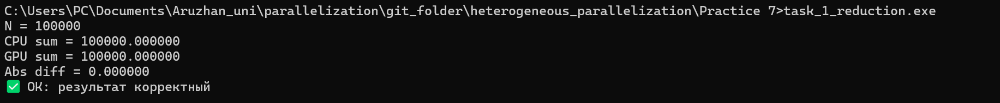
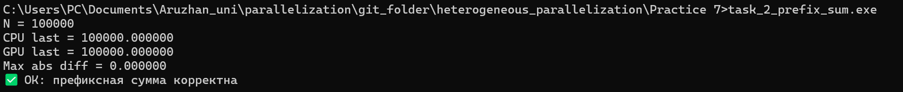
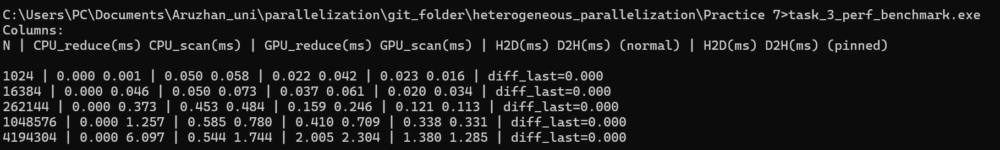

# ✅ Практическая работа №7 (CUDA)
**Тема:** Реализация редукции, префиксной суммы и анализ производительности

---

## Содержание
- [Задание 1](#task1)
  - [Блок схема](#task1-block)
  - [Вывод Терминала](#task1-terminal)
  - [Вывод](#task1-result)
- [Задание 2](#task2)
  - [Блок схема](#task2-block)
  - [Вывод Терминала](#task2-terminal)
  - [Вывод](#task2-result)
- [Задание 3](#task3)
  - [Блок схема](#task3-block)
  - [Вывод Терминала](#task3-terminal)
  - [Вывод](#task3-result)
- [Контрольные вопросы](#control-questions)

---

## 1. Теоретическая часть

### 1.1. Редукция (Reduction)
**Редукция** — это параллельная операция, которая сводит массив значений к одному результату (например сумма, максимум, минимум).  
В данной работе рассматривается **редукция суммы массива**.

**Применение редукции:**
- суммирование больших массивов данных  
- вычисление статистик (mean, variance)  
- обработка изображений и сигналов  
- этапы в нейросетях (например global pooling)

**Почему shared memory ускоряет:**
- чтение из глобальной памяти медленное  
- shared memory хранится на SM и имеет низкую задержку  
- данные загружаются в shared и суммируются локально внутри блока  

---

### 1.2. Сканирование (Prefix Sum / Scan)
**Префиксная сумма** (inclusive scan) — операция, превращающая массив:

\[
[a_0, a_1, a_2, ...] \rightarrow [a_0,\ a_0+a_1,\ a_0+a_1+a_2,\ ...]
\]

**Применение scan:**
- построение histogram  
- сортировка (radix sort)  
- stream compaction  
- построение индексов  
- параллельные алгоритмы графов  

В работе используется алгоритм **Blelloch scan**:
- up-sweep (reduce)  
- down-sweep (prefix)  
- преобразование к inclusive scan  

---

## 2. Практическая часть

### 2.1. Исходный код
Были реализованы следующие программы:

| Задание | Файл | Описание |
| ------- | ---- | -------- |
| 1 | `task_1_reduction.cu` | редукция суммы |
| 2 | `task_2_prefix_sum.cu` | префиксная сумма |
| 3 | `task_3_perf_benchmark.cu` | бенчмарк и сравнение CPU vs GPU |

---

# Задание 1: Реализация редукции

Реализовать CUDA ядро для суммирования элементов массива (reduction) с использованием shared memory.

## Блок схема

## Вывод Терминала

## Вывод
Алгоритм редукции корректно суммирует массив. Использование **shared memory** ускоряет редукцию внутри блока за счет уменьшения обращений к глобальной памяти.

---

# Задание 2: Реализация префиксной суммы

Реализовать CUDA ядро для вычисления префиксной суммы (inclusive scan) с использованием shared memory.

## Блок схема

## Вывод Терминала

## Вывод
Префиксная сумма вычисляется корректно. Реализация основана на алгоритме **Blelloch scan** в shared memory и корректно объединяет результаты между блоками.

---

# Задание 3: Анализ производительности

Выполнить измерение производительности редукции и сканирования на CPU и GPU для массивов разных размеров.  
Добавить оптимизацию с использованием pinned memory.

## Блок схема

## Вывод Терминала

## Вывод
- Для маленьких массивов CPU быстрее из-за overhead запуска CUDA-ядра и передачи данных.
- Для больших массивов GPU значительно выигрывает благодаря массовой параллельности.
- Использование pinned memory уменьшает задержки передачи данных CPU↔GPU.

---

## 2.3. Анализ производительности (Benchmark)

### 2.3.1. Замеры времени (CPU vs GPU)
Результаты выполнения `task_3_perf_benchmark.exe`:

#### Таблица 1 — Производительность

|       N | CPU Scan (ms) | GPU Scan (ms) | GPU быстрее во сколько раз |
| ------: | ------------: | ------------: | -------------------------: |
|    1024 |         0.001 |         0.058 |                      0.02× |
|   16384 |         0.046 |         0.073 |                      0.63× |
|  262144 |         0.373 |         0.484 |                      0.77× |
| 1048576 |         1.257 |         0.780 |                      1.61× |
| 4194304 |         6.097 |         1.744 |                      3.50× |

**Вывод:** GPU начинает выигрывать примерно с размера:

\[
N \ge 10^6
\]

---

### Таблица 2 — Копирование данных (обычная память vs pinned)
Pinned memory — page-locked память, ускоряющая передачу между CPU ↔ GPU.

|       N | H2D normal (ms) | H2D pinned (ms) | D2H normal (ms) | D2H pinned (ms) |
| ------: | --------------: | --------------: | --------------: | --------------: |
|    1024 |           0.022 |           0.023 |           0.042 |           0.016 |
|   16384 |           0.037 |           0.020 |           0.061 |           0.034 |
|  262144 |           0.159 |           0.121 |           0.246 |           0.113 |
| 1048576 |           0.410 |           0.338 |           0.709 |           0.331 |
| 4194304 |           2.005 |           1.380 |           2.304 |           1.285 |

✅ pinned memory даёт заметный эффект на больших N (особенно D2H).

---

## 2.3.2. Данные для графиков

### График 1: Scan время vs N (CPU и GPU)
- N: [1024, 16384, 262144, 1048576, 4194304]  
- CPU_scan: [0.001, 0.046, 0.373, 1.257, 6.097]  
- GPU_scan: [0.058, 0.073, 0.484, 0.780, 1.744]  

### График 2: H2D/D2H vs N (normal vs pinned)
- H2D_normal: [0.022, 0.037, 0.159, 0.410, 2.005]  
- H2D_pinned: [0.023, 0.020, 0.121, 0.338, 1.380]  
- D2H_normal: [0.042, 0.061, 0.246, 0.709, 2.304]  
- D2H_pinned: [0.016, 0.034, 0.113, 0.331, 1.285]  

---

## 3. Выводы

### 3.1. Анализ результатов
1. Реализация редукции и scan работает корректно (ошибка 0).
2. На маленьких N CPU работает быстрее из-за:
   - overhead kernel launch  
   - затрат на передачу данных CPU↔GPU  
3. На больших N GPU выигрывает благодаря параллельности.

### 3.2. Сравнение производительности CPU и GPU
- CPU лучше подходит для маленьких массивов.
- GPU эффективен при больших объёмах данных, особенно для scan/reduction.

### 3.3. Рекомендации по оптимизации
1. Использовать **shared memory** (сделано) → ускоряет редукцию и scan.
2. Использовать **pinned memory** → уменьшает задержки H2D/D2H.
3. Использовать **cudaMemcpyAsync + streams** для перекрытия копирования и вычислений.
4. Для scan — использовать **warp-оптимизацию** (уменьшение числа `__syncthreads()`).

---

# Контрольные вопросы
1. **В чём разница между редукцией и сканированием?**
   **Ответ:** Редукция “сжимает” массив в одно число (например сумму или максимум), то есть результат один. Сканирование (prefix sum) наоборот создаёт новый массив такой же длины, где каждый элемент — это накопленная сумма/результат до текущей позиции, поэтому scan считается более “информативной” операцией и часто используется как базовый строительный блок для других параллельных алгоритмов.

2. **Какие типы памяти CUDA используются для оптимизации редукции и сканирования?**
   **Ответ:** Основные данные хранятся в **глобальной памяти (global memory)**, но для ускорения алгоритмы активно используют **разделяемую память (shared memory)** внутри блока, чтобы уменьшить число медленных обращений к global. Также для ускорения передачи данных CPU↔GPU применяют **pinned (page-locked) host memory**, а на уровне быстрых операций внутри warp используются **регистры (registers)** и приёмы warp-оптимизации.

3. **Как можно оптимизировать префиксную сумму на GPU?**
   **Ответ:** Префиксную сумму ускоряют за счёт выполнения scan **в shared memory** (уменьшение задержек), уменьшения числа синхронизаций `__syncthreads()` с помощью **warp-level primitives** (например `__shfl_*`), оптимального выбора размера блока, а также использования **асинхронных копирований** (`cudaMemcpyAsync`) и **streams**, чтобы перекрывать вычисления и передачу данных.

4. **Приведите пример задачи, где применяется сканирование.**
   **Ответ:** Сканирование применяется, например, в задаче **stream compaction**: есть массив, и нужно быстро удалить “лишние” элементы (например все нули). Сначала строится маска 0/1, затем prefix sum по маске даёт новые индексы, куда переносить нужные элементы — так можно параллельно “упаковать” данные без последовательных циклов.
