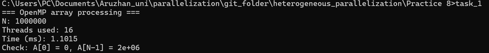
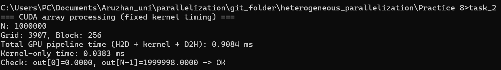
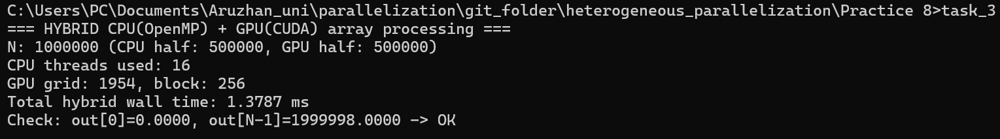

## 📑 Table of Contents

- [Задание 1](#task1)
  - [Блок схема](#task1-block)
  - [Вывод Терминала](#task1-terminal)
  - [Вывод](#task1-result)
- [Задание 2](#task2)
  - [Блок схема](#task2-block)
  - [Вывод Терминала](#task2-terminal)
  - [Вывод](#task2-result)
- [Задание 3](#task3)
  - [Блок схема](#task3-block)
  - [Вывод Терминала](#task3-terminal)
  - [Вывод](#task3-result)
- [Задание 4](#task4)
  - [Анализ производительности](#task4-analysis)
- [Выводы](#conclusions)
- [Задание дополнительное](#task-extra)
  - [Блок схема](#task-extra-block)
  - [Вывод Терминала](#task-extra-terminal)
  - [Вывод](#task-extra-result)
- [Задание дополнительное 2](#task-extra2)
  - [Блок схема](#task-extra2-block)
  - [Вывод Терминала](#task-extra2-terminal)
  - [Вывод](#task-extra2-result)
- [Контрольные вопросы](#control-questions)

---

# Задание 1 

Реализация обработки массива на CPU с использованием OpenMP

1. Создайте массив данных размером `N` (например, `N = 1 000 000`).
2. Реализуйте функцию для обработки массива на CPU с использованием
OpenMP. Например, умножьте каждый элемент массива на 2.
3. Замерьте время выполнения обработки на CPU.

## Блок схема

## Вывод Терминала

## Вывод

Результат выполнения программы OpenMP: при размере массива N = 1 000 000 обработка (умножение каждого элемента на 2) была выполнена параллельно с использованием 16 потоков. Измеренное время обработки составило 1.1015 ms. Контроль корректности показал: $A[0]=0$, $A[N-1]≈2·10^6$, что соответствует ожидаемому значению после умножения исходного массива на 2.

# Задание 2 

Реализация обработки массива на GPU с использованием CUDA

1. Скопируйте массив данных на GPU.
2. Реализуйте ядро CUDA для обработки массива на GPU. Например, умножьте
каждый элемент массива на 2.
3. Скопируйте обработанные данные обратно на CPU.
4. Замерьте время выполнения обработки на GPU.

## Блок схема

## Вывод Терминала

## Вывод
При размере массива N = 1 000 000 и конфигурации запуска Block = 256, Grid = 3907 общее время выполнения пайплайна H2D + kernel + D2H составило 0.9084 ms, а время выполнения самого CUDA-ядра — 0.0383 ms. Проверка корректности результатов показала $out[0]=0$ и $out[N−1]=1 999 998$, что соответствует ожидаемому умножению исходных данных на 2.

# Задание 3

Гибридная обработка массива

1. Разделите массив на две части: первая половина обрабатывается на CPU,
вторая — на GPU.
2. Реализуйте гибридное приложение, которое выполняет обработку массива
на CPU и GPU одновременно.
3. Замерьте общее время выполнения гибридной обработки.

## Блок схема

## Вывод Терминала

## Вывод
Гибридная обработка массива: массив N = 1 000 000 был разделён на две части: первая половина (500 000 элементов) обрабатывалась на CPU с использованием OpenMP (16 потоков), вторая половина (500 000 элементов) — на GPU с использованием CUDA. GPU часть выполнялась асинхронно в отдельном stream (копирование H2D → kernel → копирование D2H), пока CPU параллельно обрабатывал свою половину. Общее время гибридной обработки (wall time) составило 1.3787 ms. Проверка корректности подтвердила правильный результат: $out[0]=0$, $out[N−1]=1 999 998$ (умножение на 2).

| Реализация   | Что замерялось                               | Время, ms |
| ------------ | -------------------------------------------- | --------: |
| CPU (OpenMP) | обработка N на CPU                           |    1.1015 |
| GPU (CUDA)   | H2D + kernel + D2H                           |    0.9084 |
| Hybrid       | CPU half + GPU half одновременно (wall time) |    1.3787 |

# Задание 4

Анализ производительности

1. Сравните время выполнения обработки массива на CPU, GPU и в гибридном
режиме.
2. Проведите анализ производительности и определите, в каких случаях
гибридный подход дает наибольший выигрыш.

## Анализ производительности

## 1) Сравнение времени CPU / GPU / Hybrid

| Режим                                         | Что измеряли                             | Время (ms) |      Относительно CPU (ускорение) |
| --------------------------------------------- | ---------------------------------------- | ---------: | --------------------------------: |
| **CPU (OpenMP, 16 threads)**                  | обработка всего массива на CPU           | **1.1015** |                         **1.00×** |
| **GPU (CUDA)**                                | **H2D + kernel + D2H** для всего массива | **0.9084** |                 **1.21× быстрее** |
| **GPU (CUDA)**                                | **только kernel**                        | **0.0383** | (почти всё время — не вычисления) |
| **Hybrid (CPU half + GPU half одновременно)** | wall time (общее время)                  | **1.3787** |         **0.80×** (медленнее CPU) |

**Вывод по цифрам:** в этой задаче (очень лёгкая операция `*2`) **лучше всего** оказался **GPU total**, CPU чуть хуже, а **hybrid оказался хуже**, потому что накладные расходы заметнее, чем выгода от “одновременности”.

## 2) Анализ производительности: почему так вышло

### Почему GPU total быстрее CPU в твоём случае

* GPU очень быстро выполняет саму операцию: **kernel 0.0383 ms**.
* Почти всё время уходит не на вычисления, а на **передачу данных**:
  `0.9084 − 0.0383 = 0.8701 ms` → это H2D + D2H.

То есть GPU выигрывает даже с копиями — но выигрыш небольшой (**~1.21×**), потому что задача слишком простая.

### Почему hybrid оказался медленнее

Гибридное время примерно:
$T_{hybrid} \approx \max(T_{CPU(half)},; T_{GPU(half; pipeline)}) + overhead$

Где **overhead** — это:

* запуск stream + async копии + синхронизация `cudaStreamSynchronize`,
* работа OpenMP (распараллеливание цикла),
* дополнительные “стыковки” CPU↔GPU.

Для операции `*2` вычислений мало, поэтому **overhead доминирует**, и гибрид не окупается.

## 3) Когда hybrid даёт наибольший выигрыш (главный пункт)

Гибридный подход становится выгодным, когда выполняются условия:

1. **Большая вычислительная нагрузка на элемент**
   Не “одно умножение”, а, например, много операций: фильтрация, свёртки, несколько итераций, sin/cos, сложная логика, ML-инференс и т.д.
   Тогда GPU реально “забирает” тяжёлую часть, и время вычислений становится больше, чем overhead.

2. **Есть возможность перекрывать передачу данных вычислениями (overlap)**
   Hybrid особенно хорош, когда:

   * GPU считает одну часть,
   * CPU считает другую,
   * и при этом копирование/подготовка данных идёт параллельно вычислениям.

3. **Данные уже на GPU или копирование минимально**
   Если данные изначально на GPU (или используются многократно), стоимость H2D/D2H “размазывается”, и hybrid (и вообще GPU) выигрывают сильнее.

4. **Нагрузка естественно делится**
   Например: разные независимые блоки данных, разные этапы пайплайна, разные типы операций (CPU — предобработка/ветвления, GPU — плотная математика).

## 4) Короткий вывод (для отчёта)

В текущем эксперименте операция `A[i] *= 2` является “memory-bound” и слишком лёгкой по вычислениям, поэтому скорость определяется в основном накладными расходами на копирование данных и запуск параллельных вычислений. GPU показывает наилучший результат по полному циклу, однако гибридный режим оказывается менее эффективным из-за дополнительных расходов на координацию CPU и GPU. Наибольший выигрыш гибридный подход даёт в задачах с высокой вычислительной интенсивностью и возможностью перекрытия передачи данных вычислениями (pipeline/overlap), особенно когда данные уже находятся на GPU или используются многократно.

# Выводы 

### 1) **В каких случаях гибридный подход эффективен?**

Гибридный подход (CPU + GPU одновременно) эффективен, когда задача:

* **вычислительно тяжёлая** (на каждый элемент приходится много операций, а не 1 умножение);
* **хорошо параллелится** и делится на независимые части без взаимных зависимостей;
* позволяет **выполнять CPU и GPU работу параллельно**, перекрывая вычисления и передачу данных;
* использует данные **многократно**, чтобы копирование H2D/D2H не было главным источником потерь;
* содержит этапы, где **CPU лучше** (логика, ветвления, подготовка данных), а **GPU лучше** (массовая математика).

👉 В простых операциях типа `A[i] *= 2` гибрид часто не даёт выигрыш, потому что overhead (копирование и синхронизация) превышает пользу.

---

### 2) **Какие факторы влияют на производительность гибридных вычислений?**

На производительность сильнее всего влияют:

* **Объём данных** (чем больше, тем выше цена копирования между CPU и GPU)
* **Вычислительная интенсивность** (сколько операций на 1 элемент)
* **Накладные расходы GPU**: запуск kernel, синхронизация, управление stream
* **Скорость памяти и пропускная способность**:

  * RAM (CPU)
  * VRAM (GPU)
  * PCIe (между CPU и GPU)
* **Баланс нагрузки** (если CPU делает дольше — GPU простаивает, и наоборот)
* **Количество потоков CPU (OpenMP)** и правильность распределения workload
* **Правильное использование асинхронности** (`cudaMemcpyAsync`, streams)
* **Тип памяти**: pinned/pageable (pinned обычно быстрее и позволяет overlap)

---

### 3) **Как можно оптимизировать передачу данных между CPU и GPU?**

Оптимизация передачи данных — ключ к ускорению гибридных программ:

✅ Основные методы:

* Использовать **Pinned memory** (`cudaMallocHost`)
  → быстрее копирование и возможно асинхронное выполнение
* Использовать **асинхронные копии**:

  * `cudaMemcpyAsync`
  * и `cudaStream` для overlap
* **Перекрывать (overlap)**: пока GPU считает — CPU подготавливает/обрабатывает другую часть
* Копировать данные **батчами (chunks)**, а не одним большим массивом (pipeline)
* Уменьшать число копирований:

  * не копировать обратно то, что не нужно
  * оставлять данные на GPU для повторного использования
* Использовать **Unified Memory** (`cudaMallocManaged`) в некоторых сценариях (упрощает код, но не всегда быстрее)
* Оптимизировать размер transfer:

  * передавать только нужные части
  * сжимать данные/использовать меньший тип (например `half`, `uint16` если возможно)

# Контрольные вопросы

## 1) Какие преимущества предоставляют гибридные вычисления?

Гибридные вычисления позволяют **использовать сильные стороны CPU и GPU одновременно**, что даёт следующие преимущества:

* **ускорение выполнения** за счёт параллельной работы CPU и GPU;
* **лучшее использование ресурсов** системы (CPU не простаивает пока GPU считает и наоборот);
* возможность **распределять разные типы задач**: CPU — логика и управление, GPU — массовые вычисления;
* эффективная обработка больших данных за счёт высокой параллельности GPU;
* возможность **перекрывать передачу данных и вычисления** (overlap), повышая эффективность.

---

## 2) Как минимизировать накладные расходы при передаче данных между CPU и GPU?

Накладные расходы минимизируются за счёт:

* **сокращения числа копирований** (передавать только нужные данные);
* использования **Pinned memory (page-locked)** (`cudaMallocHost`) → быстрее копирование;
* применения **асинхронных копий** `cudaMemcpyAsync`;
* использования **CUDA streams**, чтобы параллельно выполнять копирование и вычисления;
* разделения данных на чанки (**pipeline**), чтобы пока один блок копируется — другой обрабатывается;
* повторного использования данных на GPU (не возвращать на CPU без необходимости).

---

## 3) Какие задачи лучше выполнять на CPU, а какие — на GPU?

### ✅ Лучше на CPU:

* задачи с большим количеством **ветвлений** (if/else), сложной логики;
* операции, где данные маленькие и нет смысла копировать на GPU;
* управление программой, ввод/вывод, распределение задач;
* последовательные алгоритмы, плохо параллелящиеся.

### ✅ Лучше на GPU:

* массовые вычисления над большими массивами (**SIMD / data-parallel**);
* линейная алгебра: матрицы, векторы, свёртки;
* обработка изображений, фильтрация, CNN;
* задачи с большим количеством одинаковых операций на элементах.

---

## 4) Как можно улучшить производительность гибридного приложения?

Производительность гибридного приложения улучшается за счёт:

* **правильного баланса нагрузки** между CPU и GPU (чтобы никто не простаивал);
* использования **асинхронных операций + streams**, чтобы перекрывать transfer и compute;
* применения **pinned memory**;
* уменьшения стоимости копирования (chunking, fewer transfers);
* “прогрева” GPU (warm-up kernel), чтобы замеры и работа были стабильнее;
* оптимизации GPU-ядра:

  * правильный `block/grid`,
  * coalesced memory access,
  * минимизация лишней синхронизации.

# Задание дополнительное
1. Реализуйте обработку массива, где каждая часть массива обрабатывается
разными операциями (например, сложение на CPU и умножение на GPU).

## Блок схема

## Вывод Терминала

## Вывод 
Дополнительное задание (разные операции на CPU и GPU): массив N = 1 000 000 был разделён на две равные части. Первая половина обрабатывалась на CPU с использованием OpenMP (операция A[i] = A[i] + 5), а вторая половина — на GPU с использованием CUDA (операция A[i] = A[i] * 2). GPU-обработка выполнялась асинхронно в stream (копирование H2D → kernel → копирование D2H), в то время как CPU параллельно выполнял свою часть. Общее время гибридной обработки (wall time) составило 2.1296 ms. Контроль корректности подтвердил правильность результатов: out[0]=5, out[half]=1 000 000, out[N−1]=1 999 998.

# Задание дополнительное 2
1. Реализуйте обработку массива, где каждая часть массива обрабатывается
разными операциями (например, сложение на CPU и умножение на GPU).

## Блок схема

## Вывод Терминала

## Вывод 

✅ Вывод 1 (CPU vs GPU)

В compute-heavy режиме (ITERS=256) GPU демонстрирует значительное преимущество по сравнению с CPU(OpenMP): ускорение составляет примерно 65×–96× в зависимости от размера массива N. Это объясняется высокой степенью параллелизма GPU и эффективной обработкой одинаковых операций над большим числом элементов.

✅ Вывод 2 (Hybrid эффективность)

Гибридный режим (CPU+GPU одновременно) показывает ускорение примерно 1.6×–2.0× относительно CPU. Это связано с тем, что часть работы выполняется на GPU параллельно, снижая нагрузку на CPU приблизительно вдвое.

✅ Вывод 3 (когда hybrid “лучший”)

Гибридный подход наиболее эффективен в условиях:

высокой вычислительной нагрузки на элемент (compute-heavy),

большого объёма данных,

возможности параллельной работы CPU и GPU (streams + OpenMP),

правильного баланса нагрузки между CPU и GPU.