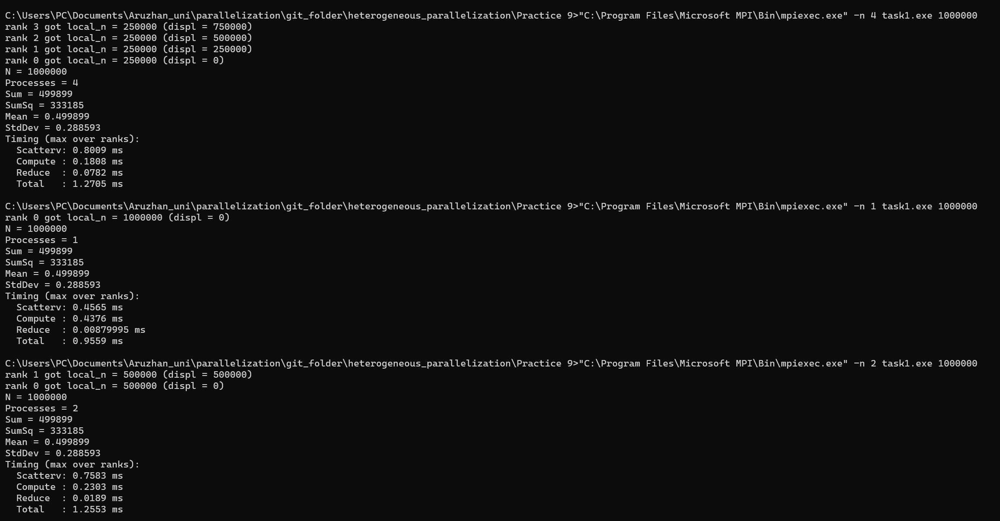
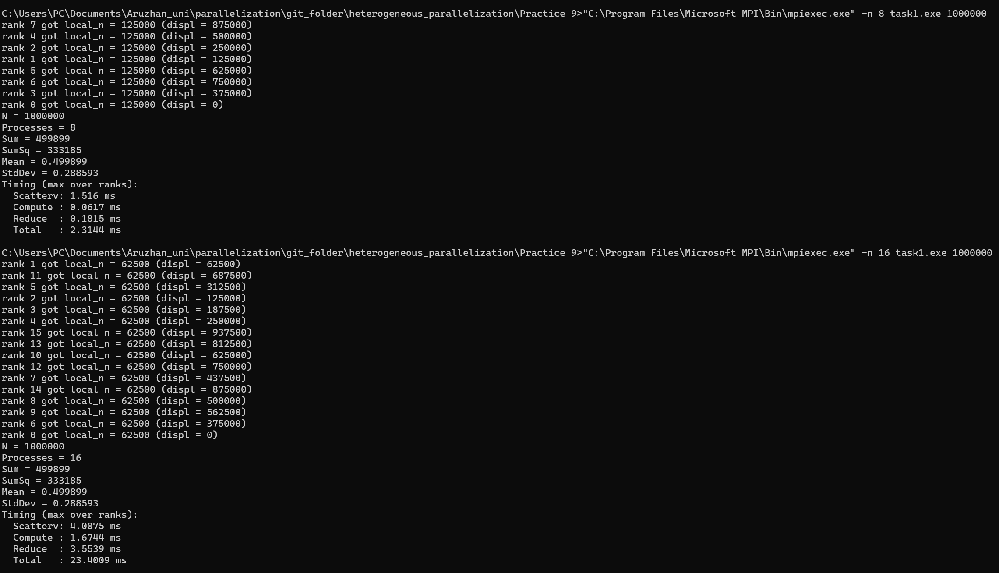
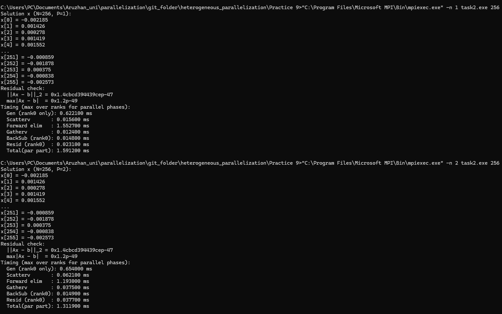
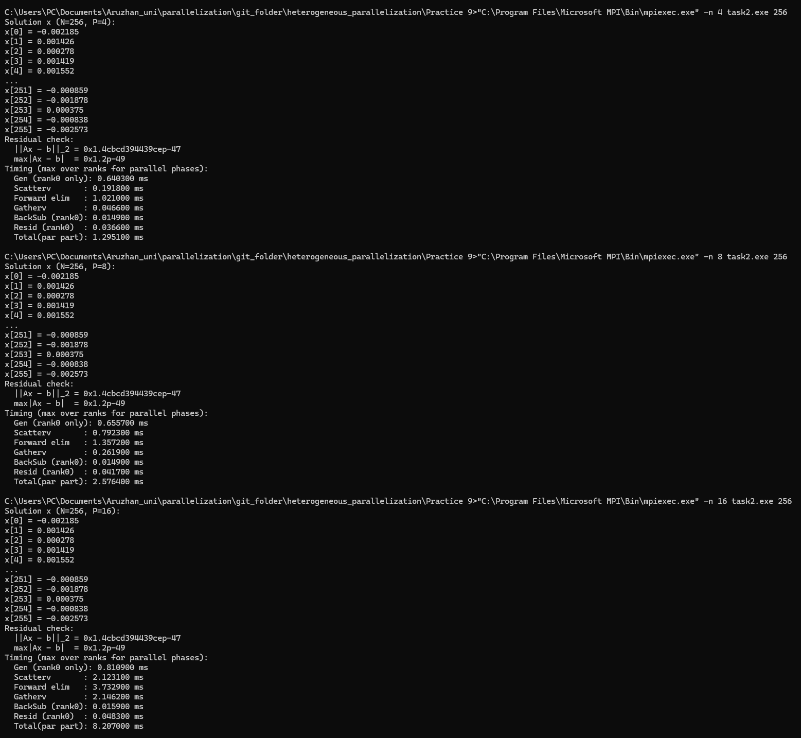
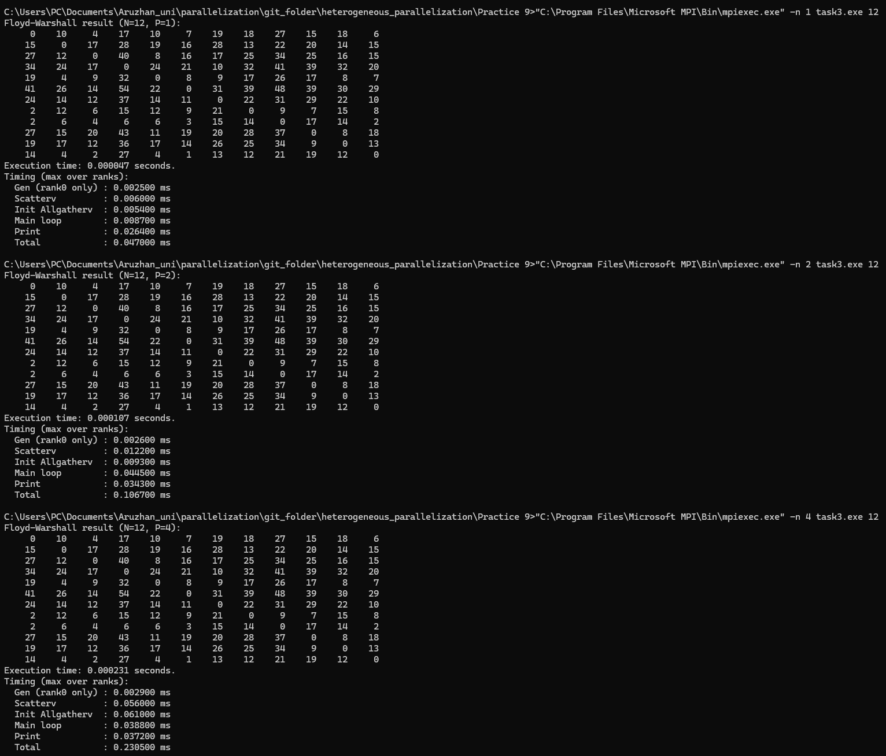
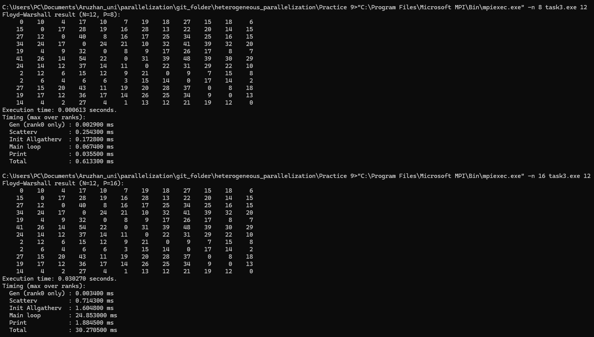

## 📑 Table of Contents

- [Задание 1](#task1)
  - [Блок схема](#task1-block)
  - [Вывод Терминала](#task1-terminal)
  - [Вывод](#task1-result)
- [Задание 2](#task2)
  - [Блок схема](#task2-block)
  - [Вывод Терминала](#task2-terminal)
  - [Вывод](#task2-result)
- [Задание 3](#task3)
  - [Блок схема](#task3-block)
  - [Вывод Терминала](#task3-terminal)
  - [Вывод](#task3-result)
- [Контрольные вопросы](#control-questions)

---

# Задание 1 

Распределённое вычисление среднего значения и стандартного
отклонения

Описание задачи:

Напишите программу, которая выполняет следующие шаги:
1. Создайте массив случайных чисел на процессе с "rank = 0". Размер массива —
N (например, N = 10^6).
2. Разделите массив между всеми процессами с помощью функции
"MPI_Scatterv" (учитывая, что массив может не делиться нацело между
процессами).
3. Каждый процесс вычисляет:
 - Сумму элементов своей части массива.
 - Сумму квадратов элементов своей части массива.
4. Соберите локальные суммы на процессе с "rank = 0" с помощью функции
"MPI_Reduce".
5. На основе собранных данных вычислите:
 - Среднее значение массива.
 - Стандартное отклонение
6. Выведите результаты на экран.

Требования:
- Используйте "MPI_Scatterv" для учёта остатка при разделении массива.
- Убедитесь, что программа работает корректно при любом количестве
процессов.

## Блок схема

## Вывод Терминала

## Вывод

| np | Scatterv (ms) | Compute (ms) | Reduce (ms) |  Total (ms) |          Speedup = T1/Tp | Efficiency = Speedup/np |
| -: | ------------: | -----------: | ----------: | ----------: | -----------------------: | ----------------------: |
|  1 |        0.4565 |       0.4376 |      0.0088 |  **0.9559** |                **1.000** |               **1.000** |
|  2 |        0.7583 |       0.2303 |      0.0189 |  **1.2553** |  0.956/1.255 = **0.762** |               **0.381** |
|  4 |        0.8009 |       0.1808 |      0.0782 |  **1.2705** |  0.956/1.271 = **0.752** |               **0.188** |
|  8 |        1.5160 |       0.0617 |      0.1815 |  **2.3144** |  0.956/2.314 = **0.413** |               **0.052** |
| 16 |        4.0075 |       1.6744 |      3.5539 | **23.4009** | 0.956/23.401 = **0.041** |               **0.003** |

При фиксированном размере массива N = 10^6 увеличение числа процессов np не приводит к ускорению, поскольку вычислительная нагрузка на каждом процессе мала, и время программы начинает определяться накладными расходами MPI: распределением данных (MPI_Scatterv), сбором результатов (MPI_Reduce), а также синхронизациями (MPI_Barrier). Дополнительно на итоговое время существенно влияет вывод информации в консоль в ранговом порядке (цикл с MPI_Barrier для каждого ранга), что особенно заметно при np = 16, где появляется резкое замедление. Таким образом, для данной задачи при N = 10^6 доминируют коммуникации и синхронизации, поэтому эффективность параллелизации падает с ростом числа процессов.  

# Задание 2
Распределённое решение системы линейных уравнений методом
Гаусса

Описание задачи:

Напишите программу для распределённого решения системы линейных
уравнений методом Гаусса:
1. Процесс с "rank = 0" создаёт матрицу коэффициентов A размером NxN и
вектор правых частей b.
2. Разделите строки матрицы между процессами с помощью функции
"MPI_Scatter".
3. Реализуйте следующие шаги метода Гаусса:
 - Прямой ход: каждый процесс выполняет вычитание строк для своей части
матрицы.
 - Обратный ход: соберите результаты на процессе с "rank = 0" и завершите
вычисления.
4. Выведите решение системы уравнений на экран.

## Блок схема

## Вывод Терминала

## Вывод

| np | Scatterv (ms) | Forward (ms) | Gatherv (ms) | T(par) (ms) | Speedup = T1/Tp | Efficiency = Speedup/np |
| -: | ------------: | -----------: | -----------: | ----------: | --------------: | ----------------------: |
|  1 |        0.0156 |       1.5527 |       0.0124 |  **1.5912** |       **1.000** |               **1.000** |
|  2 |        0.0621 |       1.1930 |       0.0375 |  **1.3119** |       **1.213** |               **0.606** |
|  4 |        0.1918 |       1.0210 |       0.0466 |  **1.2951** |       **1.229** |               **0.307** |
|  8 |        0.7923 |       1.3572 |       0.2619 |  **2.5764** |       **0.618** |               **0.077** |
| 16 |        2.1231 |       3.7329 |       2.1462 |  **8.2070** |       **0.194** |               **0.012** |

При N=256 параллельная реализация метода Гаусса показывает ограниченное ускорение: наилучший результат достигается при np=2..4 (ускорение около 1.21–1.23×). При дальнейшем росте числа процессов эффективность резко падает и наблюдается замедление (для np=16 время увеличивается до 8.207 ms). Причина — доминирование накладных расходов MPI (Scatterv/Gatherv и рассылки pivot-строки в forward elimination), которые начинают превышать выигрыш от распараллеливания вычислений при малом размере задачи.

# Задание 3

Параллельный анализ графов (поиск кратчайших путей)

Описание задачи:

Напишите программу для параллельного поиска кратчайших путей в графе с
использованием алгоритма Флойда-Уоршелла:
1. Процесс с "rank = 0" создаёт матрицу смежности графа G размером NxN.
2. Разделите строки матрицы между процессами с помощью функции
"MPI_Scatter".
3. Реализуйте алгоритм Флойда-Уоршелла:
 - Каждый процесс обновляет свою часть матрицы для текущей итерации.
 - Передайте обновлённые данные между процессами с помощью функции
"MPI_Allgather".
4. После завершения всех итераций соберите матрицу на процессе с "rank = 0" и
выведите её на экран.

## Блок схема

## Вывод Терминала

## Вывод

| np |  Total (ms) | Execution time (s) |          Speedup = T1/Tp | Efficiency |
| -: | ----------: | -----------------: | -----------------------: | ---------: |
|  1 |  **0.0470** |           0.000047 |                 **1.00** |   **1.00** |
|  2 |  **0.1067** |           0.000107 | 0.0470/0.1067 = **0.44** |   **0.22** |
|  4 |  **0.2305** |           0.000231 |                 **0.20** |   **0.05** |
|  8 |  **0.6133** |           0.000613 |                 **0.08** |   **0.01** |
| 16 | **30.2705** |           0.030270 |               **0.0016** | **0.0001** |

При размере графа N=12 параллельная реализация Floyd–Warshall не даёт ускорения: время выполнения увеличивается с ростом числа процессов (0.047 ms при np=1 до 0.613 ms при np=8 и 30.27 ms при np=16). Причина в том, что вычислительная часть для малого N очень мала, а алгоритм содержит частые коллективные коммуникации на каждом шаге k (MPI_Bcast и обязательный MPI_Allgatherv для синхронизации матрицы расстояний). При большом количестве процессов коммуникации и синхронизации доминируют, а при np > N многие процессы получают 0–1 строку, что делает использование большого np неэффективным и приводит к резкому росту накладных расходов.

# Контрольные вопросы

### **1. Как изменяется время выполнения программы при увеличении количества процессов? Почему?**

**Ответ:**
Сначала время может уменьшаться, потому что вычисления распределяются между процессами и каждый обрабатывает меньшую часть данных. Однако после некоторого значения `np` ускорение прекращается или даже появляется замедление, так как начинают доминировать накладные расходы MPI: синхронизации (`MPI_Barrier`), коллективные операции (`Scatterv`, `Gather`, `Reduce`, `Bcast`, `Allgatherv`) и задержки сети/памяти. Особенно плохо становится, если `np` слишком велико по сравнению с размером задачи (`np > N` или маленький `N`) — процессы почти ничего не считают, но всё равно участвуют в обменах.

---

### **2. Какие факторы могут влиять на производительность программы?**

**Ответ:**
На скорость MPI-программы влияют:

* **размер задачи (N)**: малые данные плохо масштабируются (overhead > вычисления)
* **соотношение вычислений и коммуникаций**: если обменов больше, чем вычислений — параллельность бесполезна
* **тип MPI-операций**: `Allgatherv`, `Bcast`, `Scatterv`, `Gatherv` могут быть дорогими
* **баланс нагрузки**: если распределение данных неравномерное (remainder), часть процессов простаивает
* **аппаратные ограничения**: число ядер CPU, скорость RAM, кэш, пропускная способность сети
* **системные накладные расходы**: запуск большого числа процессов (особенно на Windows), конкуренция за ресурсы
* **I/O** (печать в консоль): вывод сильно замедляет выполнение.

---

### **3. Как можно оптимизировать передачу данных между процессами?**

**Ответ:**
Оптимизация передачи данных достигается за счёт:

* уменьшения частоты коллективных обменов (не делать `Allgatherv` после каждого шага без нужды)
* передачи только нужных частей данных (например только pivot row вместо всей матрицы)
* использования **MPI non-blocking** операций (`MPI_Isend`, `MPI_Irecv`) для overlap вычислений и обменов
* объединения сообщений (меньше вызовов MPI → меньше overhead)
* применения более подходящих коллективных операций (`Allreduce` вместо gather+broadcast и т.д.)
* выбора хорошей схемы разбиения данных (block / cyclic / 2D decomposition).

---

### **4. Какие ограничения возникают при работе с большими данными?**

**Ответ:**
При больших данных возникают ограничения:

* **память**: матрицы `N×N` быстро становятся огромными (например Floyd/матрица расстояний)
* **коммуникации**: обмен больших массивов резко увеличивает время из-за bandwidth/latency
* **масштабируемость**: ускорение ограничено “узким местом” коммуникаций (закон Амдала)
* **переполнения типов**: при больших `INF` и суммах возможны overflow (нужно `long long`)
* **I/O bottleneck**: невозможно печатать большие матрицы или результаты целиком
* **ошибки численной устойчивости**: для Гаусса при больших матрицах без pivoting могут появиться ошибки.

