## 📑 Table of Contents

- [Задание 1](#task1)
  - [Блок схема](#task1-block)
  - [Вывод Терминала](#task1-terminal)
  - [Вывод](#task1-result)
- [Задание 2](#task2)
  - [Блок схема](#task2-block)
  - [Вывод Терминала](#task2-terminal)
  - [Вывод](#task2-result)
- [Задание 3](#task3)
  - [Блок схема](#task3-block)
  - [Вывод Терминала](#task3-terminal)
  - [Вывод](#task3-result)
- [Контрольные вопросы](#control-questions)

---

# Задание 1 

Анализ производительности CPU-параллельной программы (OpenMP)

Разработайте параллельную программу на C++ с использованием OpenMP для обработки
большого массива данных (например, вычисление суммы, среднего значения и
дисперсии).

Требуется:
- реализовать базовую параллельную версию;
- выполнить профилирование программы с использованием omp_get_wtime() и/или
профилировщика (Intel VTune, gprof);
- определить:
    - долю параллельной и последовательной части программы;
    - влияние числа потоков на ускорение;
    - проанализировать результаты в контексте закона Амдала

## Блок схема

## Вывод Терминала

## Вывод

| Threads (T) | init (s) | sum (s) | var (s) | total (s) |
| ----------: | -------: | ------: | ------: | --------: |
|           1 |    0.236 |   0.025 |   0.033 |     0.294 |
|           2 |    0.237 |   0.015 |   0.017 |     0.269 |
|           4 |    0.234 |   0.012 |   0.010 |     0.256 |
|           8 |    0.233 |   0.013 |   0.009 |     0.255 |

|  T | total (s) | Speedup | Efficiency |
| -: | --------: | ------: | ---------: |
|  1 |     0.294 |   1.000 |      1.000 |
|  2 |     0.269 |   1.093 |      0.546 |
|  4 |     0.256 |   1.148 |      0.287 |
|  8 |     0.255 |   1.153 |      0.144 |

Эксперименты показали, что ускорение программы при увеличении числа потоков OpenMP ограничено и достигает ~1.15× при 8 потоках. Причина заключается в высокой доле последовательной части: инициализация массива занимает около 80% общего времени выполнения (S≈0.80). Согласно закону Амдала, максимальное возможное ускорение при бесконечном числе потоков составляет 1/S≈1.25×, что согласуется с экспериментальными данными. При этом вычислительная часть (sum+variance) масштабируется значительно лучше (ускорение до ~2.6× на 4–8 потоках), однако её вклад в общее время мал, поэтому итоговое ускорение всей программы остаётся небольшим.

# Задание 2

Оптимизация доступа к памяти на GPU (CUDA)

Реализуйте ядро CUDA для обработки массива данных, демонстрирующее разные
паттерны доступа к памяти.
Требуется:
1. реализовать две версии ядра:
    a. с эффективным (коалесцированным) доступом к глобальной памяти;
    b. с неэффективным доступом к памяти;
2. измерить время выполнения с использованием cudaEvent;
3. провести оптимизацию за счёт:
    a. использования разделяемой памяти;
    b. изменения организации потоков;
4. сравнить результаты и сделать выводы о влиянии доступа к памяти на
производительность GPU.

## Блок схема

## Вывод Терминала

## Вывод

| Версия                            | Паттерн доступа                                                        |  Время (ms) |
| --------------------------------- | ---------------------------------------------------------------------- | ----------: |
| Coalesced (baseline)              | чтение `in[tid]`, запись `out[tid]` (последовательно)                  |  **3.2937** |
| Gather non-coalesced (stride 32)  | чтение `in[(tid*32)&(N-1)]` (разбросано), запись `out[tid]`            | **13.1311** |
| Gather non-coalesced (stride 128) | чтение `in[(tid*128)&(N-1)]` (ещё хуже), запись `out[tid]`             | **14.9530** |
| Shared tile+permute (stride 32)   | **коалесц. загрузка в shared**, перестановка в shared, коалесц. запись |  **3.0383** |
| Coalesced grid-stride             | коалесц., но grid-stride loop                                          |  **3.2150** |

| Версия                | Время (ms) |       Относительно baseline |
| --------------------- | ---------: | --------------------------: |
| Coalesced             |     3.2937 |                       1.00× |
| Gather stride 32      |    13.1311 |         **3.99× медленнее** |
| Gather stride 128     |    14.9530 |         **4.54× медленнее** |
| Shared tile+permute   |     3.0383 | **0.92× (≈ 1.08× быстрее)** |
| Grid-stride coalesced |     3.2150 |    **0.98× (почти так же)** |

Эксперимент показал, что паттерн доступа к глобальной памяти критически влияет на производительность CUDA-ядра. Коалесцированный доступ обеспечивает минимальное число транзакций и максимальную эффективную пропускную способность, поэтому baseline выполняется за ~3.29 ms. При некоалесцированном gather-доступе время возрастает до 13–15 ms (в ~4–4.5 раза медленнее), что объясняется ростом числа транзакций и ухудшением использования кеша. Использование shared memory позволяет сохранить коалесцированные глобальные обращения и перенести “нерегулярный” доступ внутрь shared, что почти полностью устраняет штраф и возвращает время к уровню baseline (~3.04 ms). Изменение организации потоков (grid-stride) в данном случае не даёт большого выигрыша, так как производительность ограничена пропускной способностью памяти при уже эффективном коалесцированном доступе.

# Задание 3

Профилирование гибридного приложения CPU + GPU

Разработайте гибридную программу, в которой часть вычислений выполняется на CPU, а
часть — на GPU.
Требуется:
1. реализовать гибридный алгоритм обработки массива данных;
2. использовать асинхронную передачу данных (cudaMemcpyAsync) и CUDA streams;
3. выполнить профилирование приложения:
    a. определить накладные расходы передачи данных;
    b. выявить узкие места при взаимодействии CPU и GPU;
4. предложить и реализовать одну оптимизацию, уменьшающую накладные расходы.

## Блок схема

## Вывод Терминала

## Вывод

Профилирование показало, что GPU-часть приложения ограничена не вычислениями, а передачей данных: при N=67,108,864 доля времени на H2D+D2H составляет ~92.9% GPU-пайплайна, тогда как ядро занимает ~7.1%. Это означает, что узким местом является пропускная способность и латентность CPU↔GPU взаимодействия (PCIe). Использование pinned memory обеспечивает корректную асинхронную передачу, а применение CUDA streams и event-based зависимостей позволяет организовать перекрытие операций; однако при очень коротком kernel эффект overlap ограничен. Для уменьшения накладных расходов целесообразно увеличивать вычислительную нагрузку на одну передачу (амортизация) либо сокращать число копирований/оставлять данные на GPU между этапами обработки.

# Задание 4

Анализ масштабируемости распределённой программы (MPI)

Реализуйте распределённую программу на MPI для вычисления агрегатной функции над
большим массивом (например, сумма, минимум, максимум).
Требуется:
- измерить время выполнения при различном числе процессов;
- оценить strong scaling и weak scaling;
- проанализировать влияние коммуникационных операций (MPI_Reduce,
MPI_Allreduce);
- сделать вывод о масштабируемости алгоритма и его практических ограничениях.

## Блок схема

## Вывод Терминала

## Вывод

|  P | total_max (s) | compute_max (s) | comm_max (s) | Speedup = T1/Tp | Efficiency = Speedup/P | Доля comm = comm/total |
| -: | ------------: | --------------: | -----------: | --------------: | ---------------------: | ---------------------: |
|  1 |      0.085721 |        0.085700 |     0.000020 |           1.000 |                  1.000 |                  0.02% |
|  2 |      0.043207 |        0.042901 |     0.000420 |           1.984 |                  0.992 |                  0.97% |
|  4 |      0.022821 |        0.022628 |     0.000177 |           3.756 |                  0.939 |                  0.78% |
|  8 |      0.012747 |        0.011667 |     0.004711 |           6.725 |                  0.841 |             **36.96%** |
| 16 |      0.013686 |        0.010321 |     0.002630 |           6.263 |                  0.391 |             **19.22%** |

При фиксированном N_global=100,000,000 программа хорошо масштабируется до 4 процессов: ускорение близко к линейному (Speedup≈3.76 при P=4), а доля коммуникаций не превышает 1% времени. Начиная с P=8 накладные расходы MPI_Reduce резко возрастают (comm≈37% total), из-за чего эффективность падает и рост ускорения замедляется. При P=16 наблюдается ухудшение общего времени относительно P=8, что указывает на практический предел strong scaling для данного размера задачи: локальный объём вычислений становится слишком мал, и коммуникации/синхронизации доминируют.

|  P |      N_global | compute_max (s) | comm_max (s) | total_max (s) | E_weak = T1/Tp | Доля comm = comm/total |
| -: | ------------: | --------------: | -----------: | ------------: | -------------: | ---------------------: |
|  1 |   100,000,000 |        0.086571 |     0.000037 |      0.086609 |          1.000 |                  0.04% |
|  2 |   200,000,000 |        0.086513 |     0.000023 |      0.086644 |          1.000 |                  0.03% |
|  4 |   400,000,000 |        0.090010 |     0.000270 |      0.090200 |          0.960 |                  0.30% |
|  8 |   800,000,000 |        0.090943 |     0.016497 |      0.091234 |          0.949 |             **18.08%** |
| 16 | 1,600,000,000 |        0.122888 |     0.050896 |      0.136743 |      **0.633** |             **37.22%** |

Для strong scaling (N_global=100 млн) наблюдается близкое к линейному ускорение до 4 процессов; при увеличении до 8 процессов доля коммуникаций заметно растёт, а при 16 процессов дальнейшее ускорение исчезает из-за доминирования накладных расходов и синхронизаций. Для weak scaling (N_local=100 млн на процесс) время почти не меняется до 4 процессов, что соответствует хорошей масштабируемости при постоянной нагрузке на процесс. Однако при 8 и особенно 16 процессах резко увеличивается время коллективных операций MPI_Reduce (до ~18% и ~37% общего времени), а также растёт compute_max, что указывает на практические ограничения: стоимость коллективов, сетевую/межпроцессную латентность, синхронизации и конкуренцию за ресурсы. Следовательно, масштабируемость алгоритма ограничена коммуникациями; при больших P целесообразно увеличивать объём вычислений на процесс или сокращать число коллективных операций (агрегация, реже вызывать reduce, использовать иерархические схемы).